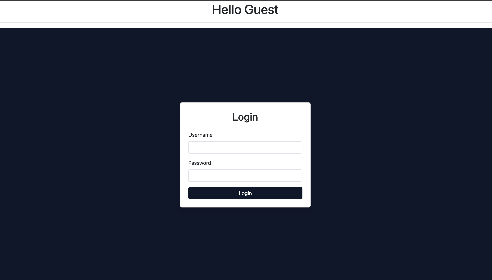
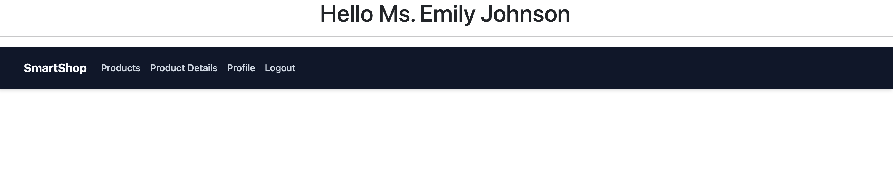
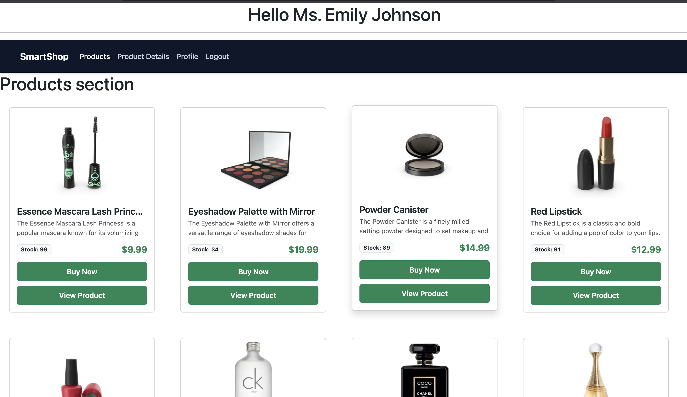
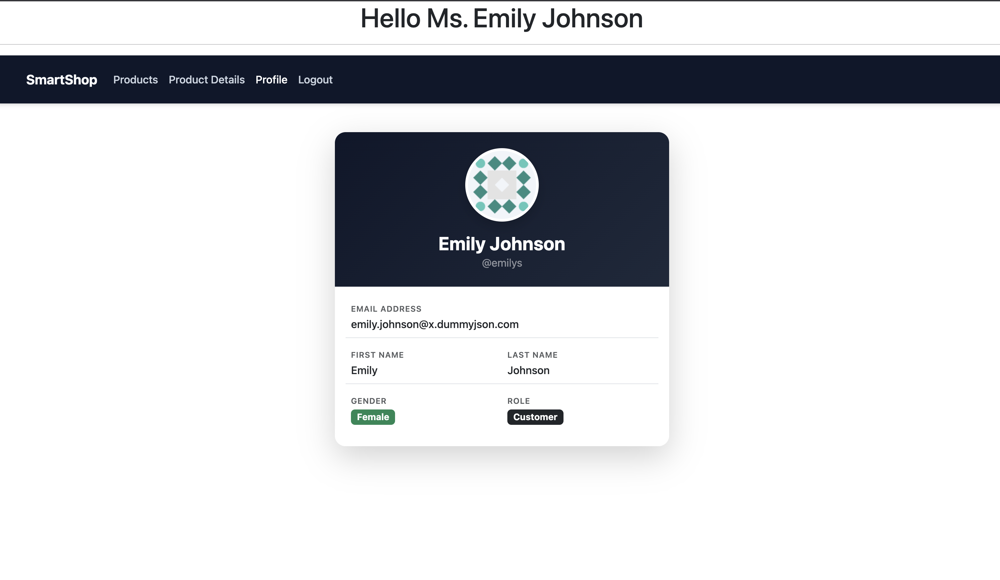
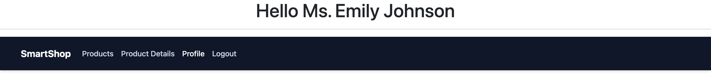

# Assignment 1 : Smart Shop Portal
Angular based application with the following concepts applied
---
# To run
- npm install
- ng serve

---
# Login Component:

- Username and Password based Login Form
- POST https://dummyjson.com/auth/login was used as api endpoint
- On successful login, the logged in user details are retreived from the payload of the generated token.
- The token is set in Session storage as passsed across different pages using pub/sub based observable.

- Token stored in session storage (subscriber)
```
//Login.ts
this.authService.loginApiCall(this.loginModel()).subscribe({
    next: (res: any) => {
        console.log("Login successful",res);
        sessionStorage.setItem('token',res.accessToken);
        alert("Login successful!");
        changeUsername()
        this.progress.set(false);
        this.router.navigate(['/dashboard'])
    },
    error: (err) => {
        console.log("login failed",err);
        alert("Login failed! Please try again");
        this.progress.set(false);
    }
})
```

- Token stored in session storage (publisher)
```
//auth.operato.ts (rxjs)
export const isLoggedIn = () => {
    const token = sessionStorage.getItem('token');
    return token?true:false;
}
```
- Api Call
```
//auth.service.ts
export class AuthService{
    constructor(private http: HttpClient){}
    public loginApiCall(loginModel:LoginModel){
        return this.http.post("https://dummyjson.com/auth/login", loginModel);
    }
}
```
- subscribe is used in login.ts to accept the changes data
- next is used to return the api response on success
- error is used throw error on unsuccessful api calls
- "sessionStorage.setItem('token',res.accessToken);" is used to get the accessToken from the return object (res) and set it as 'token' in session storage
- "changeUsername();" is used to update the username in the header component using pub/sub pattern (where the subscriber is defined in AuthService);
- "this.progress.set(false);" is used to set the progress to false
- "this.router.navigate(['/dashboard'])" is used to navigate to the dashboard page

---
# Dashboard component

- on successful login, the user is redirected to the dashboard page
- Dashboard page has header component rendered 
- username is retreived from the token payload. Salutaion is prefixed with respect to the gender of the user.

- Subject definition in auth.operator.ts
```
export const usernameSubject = new Subject<string|undefined>();
```

- Publisher in auth.operator.ts and gender based salutation
```
export const changeUsername = () => {
   const token = sessionStorage.getItem("token");
    if (token) {
        const payload = JSON.parse(atob(token.split(".")[1]));
         const fullName = payload["firstName"] + " " +payload["lastName"];
         const gender = payload["gender"];
         let title = "";
         if(gender.toLowerCase() === "male"){
            title = "Mr.";
         }else if(gender.toLowerCase() === "female"){
            title = "Ms.";
         }else{
            title = "Mx.";
         }
         if (fullName) {
            usernameSubject.next(title + " "+ fullName);
         }
    }
}
```

---
# Route protection using auth Guard

- SignalR based Login status check 
```
//auth.guard.ts
export const authGuard: CanActivateFn = (route, state) => {
  const router = inject(Router);
  if (isLoggedIn()) {
    return true;
  } else {
    router.navigate(['/']);
    return false;
  }
};
```
- Login method set
```
//auth.operator.ts
export const isLoggedIn = () => {
    const token = sessionStorage.getItem('token');
    return token?true:false;
}
```
---
# Products page

- products page is rendered only if the user is logged in
- Products are retreived from the api call (GET https://dummyjson.com/products) and displayed in cards
- product-card component is used to load individual card

- lazy loading implemented
```
//app.routes.ts
path: 'products',
loadComponent: () => import('./components/products/products').then(m => m.Products)
```
- **dynamic stock calculation** On clicking Buy Now, the stock value is reduced
- use of map function to decrement stock
```
//products.ts (parent)
this.products.update(allProducts =>
    allProducts.map(p => {
    if (p.id === product.id) {
        return { ...p, stock: p.stock - 1 };
    }
    return p;
    })
);
```
- call update stock from ProductAPIService
```
//products.ts (parent)
this.productApiService.updateProductStock(product.id, { stock: product.stock - 1 });
```

- Updating the stock on ther server using patch (changes will be viewed only for current session)
```
public updateProductStock(id: number | undefined, updatedFields: { stock: number }) {
    if (id === undefined) {
      console.warn("Product ID is undefined. Skipping remote API update.");
      return;
    }
    this.http.patch(`https://dummyjson.com/products/${id}`, updatedFields).subscribe({
      next: (res) => console.log('Product stock updated successfully on server', res),
      error: (err) => console.error('Failed to update product stock on server', err)
    });
  }
```
--- 

# Cart
- Buy now, reduces stock by one, and adds the product to cart (signal)

```
//products.ts (parent)
cart = signal<ProductModel[]>([]);
this.cart.update(currentCart => [...currentCart, product]);
```
- displaying cart with the cart() signal
```
//products.html (parent)
@if(cart().length > 0) {
    <div class="alert alert-success" role="alert">
        You have {{cart().length}} items in your cart!
    </div>
}
```

---
# Product Details Component
- On clicking the "View Product", product specific page is produced
- API Endpoint: GET https://dummyjson.com/products/{id}


- protected routing used. The product id is not visible in the url
- ProductId is passed and using navigation state and history

- passing the id to the state 
```
//products.ts 
this.router.navigate(['/dashboard/product-details'], { state: { id: id } });
```

- Getting the id from navigation state
```
//product-details.ts
id: number = 0;
ngOnInit() {
    const idFromState = history.state?.id;
    if (idFromState) {
      this.id = +idFromState;
      this.fetchProductDetails(this.id);
    }
  }
    
```

- fetching the api call for product details
```
//product-details.ts
fetchProductDetails(id: number) {
    this.productApiService.getProductById(id).subscribe({
      next: (data) => {
        this.product.set(data);
      },
      error: (err) => {
        console.error('Failed to load product details', err);
        alert("Failed to load product details");
      }
    });
  }
```
# Profile

- Profile data retreived from the token payload
```
//profile.ts
user = signal<any>(null); //signal based data tranfer to the html
const token = sessionStorage.getItem('token')
if (token) {
        const payload = JSON.parse(atob(token.split('.')[1]));
        this.user.set({
          username: payload.username,
          email: payload.email,
          firstName: payload.firstName,
          lastName: payload.lastName,
          gender: payload.gender,
          image: payload.image
        });
      }
```

# Header Component
- header has navbar and username with salutation. Look for Dashboard section for more info.


# Inter-Component Communication
- communicated to rxjs Subject

- signal definition at auth.operator.ts
```
//rxjs/auth.operator.ts
export const usernameSubject = new Subject<string|undefined>();
```

- changeUsername method to get the token and change the name displaed on dasboard
```
//rxjs/auth.operator.ts
export const changeUsername = () => {
   const token = sessionStorage.getItem("token");
    if (token) {
        const payload = JSON.parse(atob(token.split(".")[1]));
         const fullName = payload["firstName"] + " " +payload["lastName"];
         const gender = payload["gender"];
         let title = "";
         if(gender.toLowerCase() === "male"){
            title = "Mr.";
         }else if(gender.toLowerCase() === "female"){
            title = "Ms.";
         }else{
            title = "Mx.";
         }
         if (fullName) {
            usernameSubject.next(title + " "+ fullName);
         }
    }
}
```

- username called at app.html
```
//app.html
<h1 align="center"> Hello {{username()}}</h1>
```

# Routing

```
{ path: '', component: Login },
    {
        path: 'dashboard', component: Dashboard,
        canActivate: [authGuard],
        children: [
            {
                path: 'products',
                loadComponent: () => import('./components/products/products').then(m => m.Products)
            },
            {
                path: 'product-details',
                component: ProductDetails
            },
            { path: 'profile', component: Profile }
        ]
    }

```
- Products, Product-detail and Profile act as child to dashboard to display the header

- dashboard.html
```
<app-header></app-header>
<router-outlet></router-outlet>
```
- In the place of router-outlet the children are loaded (below the header)

# Route Protection
- It is performed using authGuard.
- SignalR based Login status check


