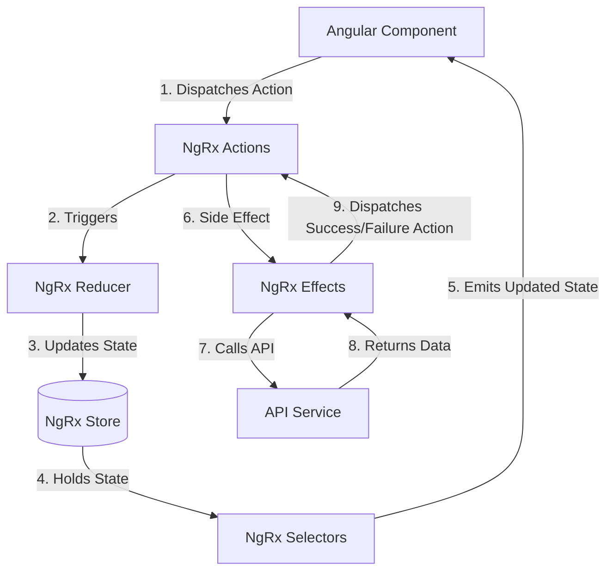

# Angular & Modern Frontend Architecture: Concepts Analysis

This document provides a comprehensive analysis of the concepts, mechanisms, and syntax implemented in the **Learn** Angular application. It covers their working principles, code examples from the project, and the CLI/npm commands required to manage the application.

---

## Table of Contents
1. [Core Angular Framework Concepts](#1-core-angular-framework-concepts)
   - [Standalone Components & Root Configuration](#standalone-components--root-configuration)
   - [Signals API (Modern State Management)](#signals-api-modern-state-management)
   - [Modern Control Flow (Angular 17+)](#modern-control-flow-angular-17)
2. [Component Communication](#2-component-communication)
   - [Parent-to-Child Property Binding](#parent-to-child-property-binding)
   - [Child-to-Parent Event Emitting](#child-to-parent-event-emitting)
3. [Routing & Navigation](#3-routing-navigation)
   - [Router Outlet, Router Links & Lazy Loading](#router-outlet-router-links--lazy-loading)
   - [Route Parameter Passing vs. History State API](#route-parameter-passing-vs-history-state-api)
   - [Functional Route Guards (`CanActivateFn`)](#functional-route-guards-canactivatefn)
4. [Forms & Input Validation](#4-forms--input-validation)
   - [Signal-Based Forms API (Angular 19+)](#signal-based-forms-api-angular-19)
   - [Template-Driven Forms (Traditional)](#template-driven-forms-traditional)
5. [Services & HTTP Client Module](#5-services--http-client-module)
   - [Dependency Injection & API Consumers](#dependency-injection--api-consumers)
   - [Functional HTTP Interceptors (`HttpInterceptorFn`)](#functional-http-interceptors-httpinterceptorfn)
6. [Reactive State Management with NgRx](#6-reactive-state-management-with-ngrx)
   - [Store, Actions, Reducers & Selectors](#store-actions-reducers--selectors)
   - [NgRx Effects (Asynchronous Pipelines)](#ngrx-effects-asynchronous-pipelines)
7. [RxJS Reactive Streams & Operators](#7-rxjs-reactive-streams--operators)
   - [Subjects & Subscriptions](#subjects--subscriptions)
   - [Debouncing, Deduplication, and Request Switching](#debouncing-deduplication-and-request-switching)
   - [Async Pipe (`| async`)](#async-pipe--async)
8. [CLI & Development Commands](#8-cli--development-commands)

---

## 1. Core Angular Framework Concepts

### Standalone Components & Root Configuration
* **Working Principle**: Standalone components eliminate the need for traditional `NgModule` bootstrap structures. Each component declares its own dependencies (other components, directives, pipes, or modules) directly in its `@Component` decorator imports.
* **Code Example**:
  * **Root Component Class** (`src/app/app.ts`):
    ```typescript
    import { Component, signal } from '@angular/core';
    import { RouterOutlet } from '@angular/router';
    import { Navigation } from './navigation/navigation';

    @Component({
      selector: 'app-root',
      imports: [RouterOutlet, Navigation],
      templateUrl: './app.html',
      styleUrl: './app.css'
    })
    export class App {
      username = signal('Guest');
      // ...
    }
    ```
  * **Application Level Configuration** (`src/app/app.config.ts`):
    ```typescript
    import { ApplicationConfig, isDevMode } from '@angular/core';
    import { provideRouter } from '@angular/router';
    import { provideHttpClient, withInterceptors } from '@angular/common/http';
    import { provideStore } from '@ngrx/store';
    import { provideEffects } from '@ngrx/effects';
    import { routes } from './app.routes';
    import { authInterceptor } from './authInterceptor';
    import { transactionReducer } from './store/transaction.reducer';
    import { TransactionEffects } from './store/transaction.effects';

    export const appConfig: ApplicationConfig = {
      providers: [
        provideRouter(routes),
        provideHttpClient(withInterceptors([authInterceptor])),
        provideStore({ transaction: transactionReducer }),
        provideEffects(TransactionEffects),
        provideStoreDevtools({ maxAge: 25, logOnly: !isDevMode() }),
      ],
    };
    ```

### Signals API (Modern State Management)
* **Working Principle**: Signals represent a reactive value wrapper that informs Angular exactly where and when state changes. This enables fine-grained change detection and DOM updates without checking the entire component tree.
* **Code Example**:
  * **Declaring, Reading, and Mutating Signals** (`src/app/transaction-filter/transaction-filter.ts`):
    ```typescript
    export class TransactionFilterComponent {
      // Declaring a signal wrapping a model
      filter = signal(new TransactionFilter());

      // Updating a signal value immutably using the .update() method
      updateFromAccountNumber(value: string) {
        this.filter.update((current) => ({
          ...current,
          fromAccountNumber: value,
        }));
      }

      // Overwriting a signal value using the .set() method
      onClearFilter() {
        this.filter.set(new TransactionFilter());
      }
    }
    ```

### Modern Control Flow (Angular 17+)
* **Working Principle**: Replaces old structural directives (`*ngIf`, `*ngFor`) with built-in declarative blocks. These are parsed at compile-time, delivering cleaner template syntax and better performance.
* **Code Example** (`src/app/products/products.html`):
  ```html
  <!-- Conditional rendering using @if -->
  @if(cart().length > 0) {
      <div class="alert alert-success" role="alert">
          You have {{cart().length}} items in your cart!
      </div>
  }

  <!-- List rendering using @for and tracking unique identifiers -->
  <section class="products-container">
     @for (product of products(); track product.id) 
     {
          <app-product [product]="product" (buy)="handleBuy($event)"/>
     }
  </section>
  ```

---

## 2. Component Communication

### Parent-to-Child Property Binding
* **Working Principle**: The parent passes state downwards into a child component's input properties.
* **Code Example**:
  * **Child Inputs Setup** (`src/app/product/product.ts`):
    ```typescript
    import { Component, input } from '@angular/core';
    import { ProductModel } from './models/product.model';

    export class Product {
      // Signal-based input retrieval
      product = input<ProductModel>();
    }
    ```
  * **Parent Binding Syntax** (`src/app/products/products.html`):
    ```html
    <app-product [product]="product" />
    ```

### Child-to-Parent Event Emitting
* **Working Principle**: The child component fires an event to notify the parent about user interactions or data changes.
* **Code Example**:
  * **Child Output Setup & Trigger** (`src/app/product/product.ts`):
    ```typescript
    import { Component, output } from '@angular/core';
    import { ProductModel } from './models/product.model';

    export class Product {
      // Modern signal-based output emitter
      buy = output<ProductModel|undefined>();

      handleClick() {
        // Emitting data upwards
        this.buy.emit(this.product());
      }
    }
    ```
  * **Parent Handling** (`src/app/products/products.ts` & `.html`):
    ```html
    <!-- Listen for output custom event '(buy)' and capture payload with '$event' -->
    <app-product [product]="product" (buy)="handleBuy($event)" />
    ```
    ```typescript
    handleBuy(product: ProductModel | undefined) {
      alert(`You bought ${product?.title} for $${product?.price}`);
      this.cart().push(product!);
    }
    ```

---

## 3. Routing & Navigation

### Router Outlet, Router Links & Lazy Loading
* **Working Principle**: Single Page Applications swap components dynamically based on the active path without refreshing the page. The `<router-outlet>` serves as the dynamic viewport.
* **Code Example**:
  * **Route Config** (`src/app/app.routes.ts`):
    ```typescript
    import { Routes } from '@angular/router';
    import { Customer } from './customer/customer';

    export const routes: Routes = [
        // Eager Loaded Route
        { path: 'home', component: Customer },
        // Lazy Loaded Route using dynamic import
        { path: 'products', loadComponent: () => import('./products/products').then(m => m.Products) },
    ];
    ```
  * **Navigation & Viewport** (`src/app/navigation/navigation.html` & `src/app/app.html`):
    ```html
    <!-- navigation.html - Internal navigation using routerLink -->
    <a class="nav-link" routerLink="products">Products</a>

    <!-- app.html - Component replacement anchor point -->
    <router-outlet></router-outlet>
    ```

### Route Parameter Passing vs. History State API
* **Parameterized Routing (Visible URL)**:
  * Route: `{ path: 'transaction/:accNum', component: Transaction }`
  * Reading from active URL snapshot:
    ```typescript
    constructor(private activeRoute: ActivatedRoute) {
      this.fromaccountNumber = this.activeRoute.snapshot.params['accNum'];
    }
    ```
* **History State API (Secure, Clean URL)**:
  * Passing parameter in router memory state:
    ```typescript
    this.router.navigate(['/account/transaction'], { state: { accNum: this.accountDetails.accountNumber } });
    ```
  * Reading from browser's navigation history in destination component:
    ```typescript
    constructor() {
      this.fromaccountNumber = history.state?.accNum || '';
    }
    ```

### Functional Route Guards (`CanActivateFn`)
* **Working Principle**: Protects routes by validating specific conditions (e.g., user is authenticated) before navigating.
* **Code Example** (`src/app/guards/authGuard.ts`):
  ```typescript
  import { inject } from "@angular/core";
  import { CanActivateFn, Router } from "@angular/router";
  import { isLoggedIn } from "../rxjs/auth.operator";

  export const authGuard: CanActivateFn = () => {
      const router = inject(Router);
      const userStatus = isLoggedIn();

      if (userStatus) {
          return true; // Allow navigation
      }
      
      router.navigate(["login"]);    
      alert("Please Login to continue");
      return false; // Prevent navigation
  };
  ```

---

## 4. Forms & Input Validation

### Signal-Based Forms API (Angular 19+)
* **Working Principle**: The modern declarative forms API bound directly to Signal objects. It allows programmatic definition of form fields, validation states, and reactive error collection directly in the typescript class.
* **Code Example**:
  * **Class setup** (`src/app/login/login.ts`):
    ```typescript
    import { form, required, minLength } from '@angular/forms/signals';

    export class Login {
      loginModel = signal(new LoginModel());
      
      loginForm = form(this.loginModel, (path) => {
        required(path.username, { message: "Username is required" });
        minLength(path.username, 4, { message: "Username must be at least 4 characters long" });
        required(path.password, { message: "Password is required" });
      });
    }
    ```
  * **Template usage** (`src/app/login/login.html`):
    ```html
    <form (ngSubmit)="handleLoginClick()">
      <div>
        <label for="username">Username:</label>
        <input type="text" id="username" [formField]="loginForm.username">
        
        @for (error of loginForm.username().errors(); track error.message) {
            <div class="alert alert-danger">{{ error.message }}</div>
        }
      </div>
      <button [disabled]="loginForm().invalid()" type="submit">Login</button>
    </form>
    ```

### Template-Driven Forms (Traditional)
* **Working Principle**: Declares model binding and validation rules directly inside HTML.
* **Code Example** (`src/app/register/register.html`):
  ```html
  <form (submit)="handleRegisterClick()">
      <div class="group">
          <label for="username">Username</label>
          <input type="text" id="username" [(ngModel)]="registerModel().username" name="username" required>
      </div>
      <div class="group">
          <label for="email">Email</label>
          <input type="email" id="email" [(ngModel)]="registerModel().email" name="email" required>
      </div>
      <button type="submit">Register</button>
  </form>
  ```

---

## 5. Services & HTTP Client Module

### Dependency Injection & API Consumers
* **Working Principle**: Services are singleton classes containing business logic. They are decorated with `@Injectable({ providedIn: 'root' })` to be injected into components or other services automatically.
* **Code Example** (`src/app/services/product.api.service.ts`):
  ```typescript
  import { HttpClient } from "@angular/common/http";
  import { Injectable } from "@angular/core";

  @Injectable({
    providedIn: 'root'
  })
  export class ProductApiService {
    constructor(private http: HttpClient) {}

    public getProductsFromDummyJson() {
      return this.http.get("https://dummyjson.com/products");
    }
  }
  ```

### Functional HTTP Interceptors (`HttpInterceptorFn`)
* **Working Principle**: Middleware that intercepts all outgoing HTTP requests, allowing modifications (such as injecting authorization headers) globally before transmission.
* **Code Example** (`src/app/authInterceptor.ts`):
  ```typescript
  import { HttpInterceptorFn } from "@angular/common/http";

  export const authInterceptor: HttpInterceptorFn = (req, next) => {
      const token = sessionStorage.getItem('token');
      console.log('Token from storage:', token);

      if (token) {
          // Clone the request and insert header containing bearer token
          const cloned = req.clone({
              headers: req.headers.set('Authorization', `Bearer ${token}`)
          });
          return next(cloned);
      }
      return next(req);
  };
  ```

---

## 6. Reactive State Management with NgRx

NgRx provides a unidirectional state cycle for transaction data.



### Store, Actions, Reducers & Selectors
* **Actions Setup** (`src/app/store/transaction.action.ts`):
  ```typescript
  import { createAction, props } from "@ngrx/store";
  import { TransactionFilter } from "../models/transaction.filter.model";
  import { TransactionList } from "../models/transaction.list.model";

  export const updateTransactionFilter = createAction(
    "[TransactionList] Update Filter",
    props<{ filter: TransactionFilter }>()
  );

  export const loadTransaction = createAction(
    "[TransactionList] Load"
  );

  export const loadTransactionSuccess = createAction(
    "[TransactionList] Load Success",
    props<{ transactionList: TransactionList }>()
  );
  ```
* **Reducer Logic** (`src/app/store/transaction.reducer.ts`):
  ```typescript
  import { createReducer, on } from "@ngrx/store";
  import { updateTransactionFilter, loadTransaction, loadTransactionSuccess } from "./transaction.action";

  export const transactionReducer = createReducer(
      initialTransactionState,

      on(updateTransactionFilter, (state, { filter }) => ({
          ...state,
          filter: { ...state.filter, ...filter },
      })),

      on(loadTransaction, (state) => ({
          ...state,
          loading: true,
          error: null
      })),

      on(loadTransactionSuccess, (state, { transactionList }) => ({
          ...state,
          transactionList,
          loading: false,
          error: null
      }))
  );
  ```
* **Selectors** (`src/app/store/transaction.selector.ts`):
  ```typescript
  import { createFeatureSelector, createSelector } from "@ngrx/store";
  import { TransactionState } from "./transaction.reducer";

  export const selectTransactionState = createFeatureSelector<TransactionState>('transaction');

  export const selectTransactionList = createSelector(
      selectTransactionState,
      (state) => state?.transactionList ?? null
  );
  ```

### NgRx Effects (Asynchronous Pipelines)
* **Code Example** (`src/app/store/transaction.effects.ts`):
  ```typescript
  import { inject, Injectable } from "@angular/core";
  import { Actions, createEffect, ofType } from "@ngrx/effects";
  import { loadTransaction, loadTransactionSuccess, loadTransactionFailure, updateTransactionFilter, clearTransactionFilter } from "./transaction.action";
  import { switchMap, map, catchError, withLatestFrom, debounceTime } from "rxjs/operators";
  import { of } from "rxjs";
  import { Store } from "@ngrx/store";
  import { slectTransactionFilter } from "./transaction.selector";
  import { TransactionService } from "../services/transaction.service";

  @Injectable()
  export class TransactionEffects {
      private actions$ = inject(Actions);
      private store = inject(Store);
      private transactionService = inject(TransactionService);

      // Trigger load when filters change (with debouncing)
      loadTransactionListOnFilterChange$ = createEffect(() => {
          return this.actions$.pipe(
              ofType(updateTransactionFilter, clearTransactionFilter),
              debounceTime(500),
              map(() => loadTransaction())
          );
      });

      // Query API for transaction list
      loadTransaction$ = createEffect(() => {
          return this.actions$.pipe(
              ofType(loadTransaction),
              withLatestFrom(this.store.select(slectTransactionFilter)),
              switchMap(([action, filter]) =>
                  this.transactionService.getTransactions(filter).pipe(
                      map(transactionList => loadTransactionSuccess({ transactionList } as any)),
                      catchError(error => of(loadTransactionFailure({ error: error.message })))
                  )
              )
          );
      });
  }
  ```

---

## 7. RxJS Reactive Streams & Operators

### Subjects & Subscriptions
* **Working Principle**: A `Subject` acts as both an Observable and an Observer. It can broadcast values to multiple observers (subscribers).
* **Code Example**:
  * **Shared Subject Emitter** (`src/app/rxjs/auth.operator.ts`):
    ```typescript
    import { Subject } from "rxjs";

    export const usernameSubject = new Subject<string|undefined>();

    export const changeUsername = () => {
        const token = sessionStorage.getItem("token");
        if (token) {
            // Decode claims
            const payload = JSON.parse(atob(token.split(".")[1]));
            const name = payload["http://schemas.xmlsoap.org/ws/2005/05/identity/claims/givenname"];
            if (name) {
                usernameSubject.next(name); // Emit decoded username
            }
        }
    };
    ```
  * **Subscriber listener** (`src/app/app.ts`):
    ```typescript
    export class App {
      username = signal('Guest');

      constructor() {
        // Subscribe to changes in active username
        usernameSubject.subscribe({
          next: (un) => {
            this.username.set(un ? un : 'Guest');
          }
        });
      }
    }
    ```

### Debouncing, Deduplication, and Request Switching
* **Working Principle**: Mitigates duplicate server queries while checking autocomplete input values.
* **Code Example** (`src/app/account/account.ts`):
  ```typescript
  import { debounceTime, distinctUntilChanged, switchMap, of, Subject } from 'rxjs';

  export class Account {
    searchSubject = new Subject<string>();

    constructor(private bankingApiService: BankingApiService) {
      this.subscription = this.searchSubject.pipe(
        debounceTime(500),         // Wait 500ms after user pauses typing
        distinctUntilChanged(),   // Skip duplicates
        switchMap(accNumber => {   // Discard preceding pending requests, execute new search
          if(accNumber.trim() === '') {
            return of({});
          }
          return this.bankingApiService.getAccountDetails(accNumber);
        })
      ).subscribe((response) => {
        this.accountDetails = response;
      });
    }

    getAccountDetails() {
      // Pushing values into the subject pipeline
      this.searchSubject.next(this.searchAccountNumber);
    }
  }
  ```

### Async Pipe (`| async`)
* **Working Principle**: Subscribes to an observable in templates and automatically cleans it up on component destruction.
* **Code Example** (`src/app/transaction-list/transaction-list.html`):
  ```html
  <!-- Automatically handles subscribing and unsubscribing from transactions$ observable -->
  @if (transactions$ | async; as transactions) 
  {
      <table class="table">
          <tbody>
              @for (transaction of transactions.items; track transaction.id)
              {
                  <tr>
                      <td>{{ transaction.fromAccountNumber }}</td>
                      <td>{{ transaction.amount }}</td>
                  </tr>
              }
          </tbody>
      </table>
  }
  ```

---

## 8. CLI & Development Commands

Use the following commands inside the `Angular/Learn` directory:

| Command | Action / Purpose |
|---|---|
| **`npm run start`** or **`ng serve`** | Launches the local dev server at `http://localhost:4200/`. |
| **`npm run build`** or **`ng build`** | Compiles the project and outputs optimized bundle files in `dist/`. |
| **`npm run test`** or **`ng test`** | Executes unit tests with the **Vitest** runner. |
| **`ng generate component <name>`** | Generates a new standalone component structure. |
| **`ng generate service <name>`** | Generates a new injectable service singleton. |
| **`ng generate --help`** | Displays a full list of scaffolding blueprints (pipes, guards, etc.). |
| **`npx prettier --write .`** | Code formatter configuration used for style check consistency. |
