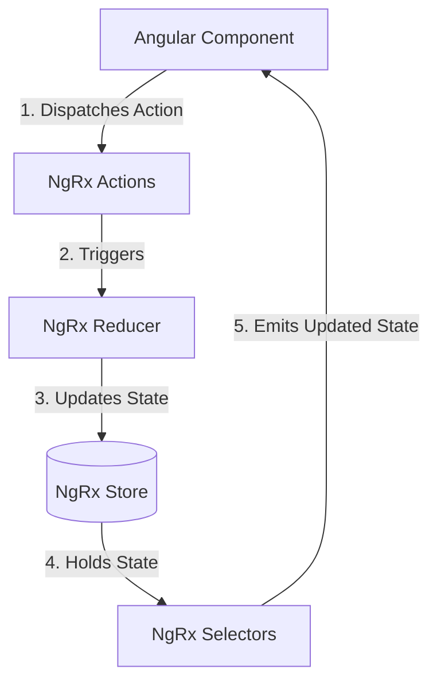

# NgRx State Management (Transactions)

This document explains the NgRx store architecture (Actions, Reducer, and Selectors) used for managing transaction state in the **Learn** Angular application.

---

## Architecture Overview
NgRx provides reactive state management. The data flow is unidirectional:
1. **Actions** represent events or intentions (e.g., updating a filter or receiving loading results).
2. **Reducers** listen for Actions and return a new state, updating the store immutably.
3. **Selectors** query specific slices of the state from the store so components can subscribe to them.



---

## 1. Actions
Defined in: [transaction.action.ts](file:///Users/dharshinik/Desktop/Presidio/Genspark/Angular/Learn/src/app/store/transaction.action.ts)

Actions are dispatched to express an event. The transaction store defines four key actions:

* **[updateTransactionFilter](file:///Users/dharshinik/Desktop/Presidio/Genspark/Angular/Learn/src/app/store/transaction.action.ts#L5-L8)**:
  * **Event**: `[TransactionList] Update Filter`
  * **Purpose**: Dispatched when filtering options (such as dates, amounts, pagination, or sorting) change.
  * **Payload**: [TransactionFilter](file:///Users/dharshinik/Desktop/Presidio/Genspark/Angular/Learn/src/app/models/transaction.filter.model.ts#L1) object containing new or updated criteria.
* **[clearTransactionFilter](file:///Users/dharshinik/Desktop/Presidio/Genspark/Angular/Learn/src/app/store/transaction.action.ts#L11-L13)**:
  * **Event**: `[TransactionList] Clear Filter`
  * **Purpose**: Dispatched to reset all filter values back to their defaults.
  * **Payload**: None.
* **[loadTransactionSuccess](file:///Users/dharshinik/Desktop/Presidio/Genspark/Angular/Learn/src/app/store/transaction.action.ts#L15-L18)**:
  * **Event**: `[TransactionList] Load Success`
  * **Purpose**: Dispatched when transaction data is successfully fetched from the backend API.
  * **Payload**: [TransactionList](file:///Users/dharshinik/Desktop/Presidio/Genspark/Angular/Learn/src/app/models/transaction.list.model.ts#L3) object containing item list, counts, and page details.
* **[loadTransactionFailure](file:///Users/dharshinik/Desktop/Presidio/Genspark/Angular/Learn/src/app/store/transaction.action.ts#L20-L23)**:
  * **Event**: `[TransactionList] Load Failure`
  * **Purpose**: Dispatched if the API request fails.
  * **Payload**: An error message string.

---

## 2. Reducer & State
Defined in: [transaction.reducer.ts](file:///Users/dharshinik/Desktop/Presidio/Genspark/Angular/Learn/src/app/store/transaction.reducer.ts)

The reducer manages state mutations.

### State Interface
The structure of this state slice is defined by [TransactionState](file:///Users/dharshinik/Desktop/Presidio/Genspark/Angular/Learn/src/app/store/transaction.reducer.ts#L7-L12):
```typescript
export interface TransactionState {
    filter: TransactionFilter;               // Current filtering/pagination settings
    transactionList: TransactionList | null; // The returned list of transactions
    loading: boolean;                        // Flag for active loading indicators
    error: string | null;                    // Contains error string if load fails
}
```

### Initial State Constants
* **[initialTransactionFilter](file:///Users/dharshinik/Desktop/Presidio/Genspark/Angular/Learn/src/app/store/transaction.reducer.ts#L14-L24)**: Sets default filtering properties (e.g., `pageNumber: 1`, `pageSize: 10`, `sortBy: "TransactionDate"`, `sortDirection: "desc"`).
* **[initialTransactionState](file:///Users/dharshinik/Desktop/Presidio/Genspark/Angular/Learn/src/app/store/transaction.reducer.ts#L27-L32)**: Sets default state values (`filter` loaded with defaults, lists set to `null`, loading `false`, error `null`).

### Reducer Logic
The [transactionReducer](file:///Users/dharshinik/Desktop/Presidio/Genspark/Angular/Learn/src/app/store/transaction.reducer.ts#L34-L61) updates state immutably:
* **`updateTransactionFilter`**: Merges incoming fields with the existing filter:
  ```typescript
  filter: { ...state.filter, ...filter }
  ```
* **`clearTransactionFilter`**: Sets filter back to `initialTransactionFilter`.
* **`loadTransactionSuccess`**: Populates `transactionList`, resets `loading` to `false`, and clears any `error`.
* **`loadTransactionFailure`**: Clears `transactionList`, sets `loading` to `false`, and assigns the `error` message.

---

## 3. Selectors
Defined in: [transaction.selector.ts](file:///Users/dharshinik/Desktop/Presidio/Genspark/Angular/Learn/src/app/store/transaction.selector.ts)

Selectors fetch slice data. They are memoized to optimize performance and prevent unnecessary change detection runs.

* **[selectTransactionState](file:///Users/dharshinik/Desktop/Presidio/Genspark/Angular/Learn/src/app/store/transaction.selector.ts#L5)**: Obtains the root feature state named `'transaction'`.
* **[selectTransactionFilter](file:///Users/dharshinik/Desktop/Presidio/Genspark/Angular/Learn/src/app/store/transaction.selector.ts#L7-L10)**: Selects the active filters. *(Note: Contains a minor typo in the variable name `select...` rather than `select...`)*.
* **[selectTransactionList](file:///Users/dharshinik/Desktop/Presidio/Genspark/Angular/Learn/src/app/store/transaction.selector.ts#L12-L15)**: Retrieves the loaded transactions list.
* **[selectTransactionLoading](file:///Users/dharshinik/Desktop/Presidio/Genspark/Angular/Learn/src/app/store/transaction.selector.ts#L17-L20)**: Returns `true` if transactions are currently loading.
* **[selectTransactionError](file:///Users/dharshinik/Desktop/Presidio/Genspark/Angular/Learn/src/app/store/transaction.selector.ts#L22-L25)**: Obtains any load errors.

---

## Typical Lifecycle Example

1. **User interaction**: A user clicks to change the sorting order.
2. **Action Dispatch**: The component dispatches:
   ```typescript
   this.store.dispatch(updateTransactionFilter({ sortBy: 'Amount', sortDirection: 'asc' }));
   ```
3. **State Update**: The reducer updates the state filter parameters.
4. **Data Fetch (Effects)**: An NgRx Effect detects the filter change, calls the backend service API, and returns the list.
5. **Action Dispatch**: The Effect dispatches `loadTransactionSuccess({ transactionList })`.
6. **State Update**: Reducer updates the store state with the new list.
7. **Component Render**: The component listening via the selector (`this.store.select(selectTransactionList)`) gets the updated list and renders it on screen.
