# PROJECT OVERVIEW
Portfolio using HTML and CSS
--- 
# Project Section
- About
- Education + Experience
- Skills
- Projects
---
# CONCEPTS USED
- Div based components
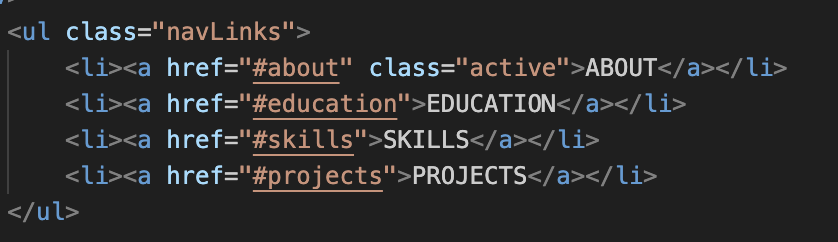
- Navbar based Referencing

- Id based element referencing
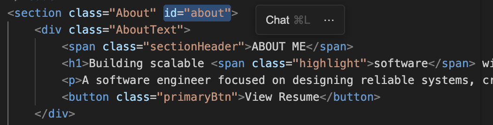
- Flex based Component Arrangement (if arrangement is not tabular)

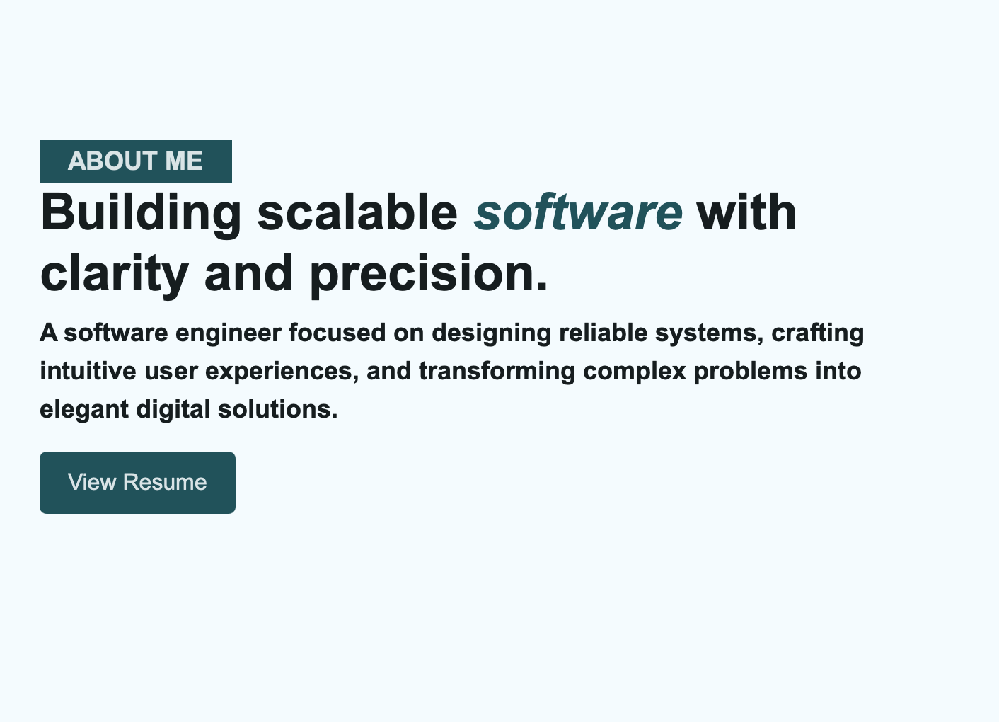
- Grid based Component Arrangement (if arrangement is tabular)
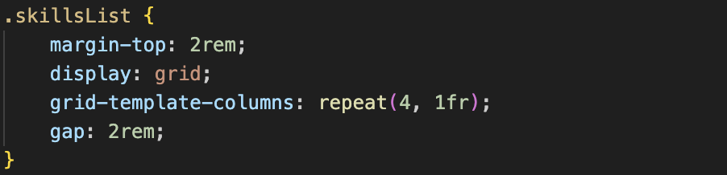
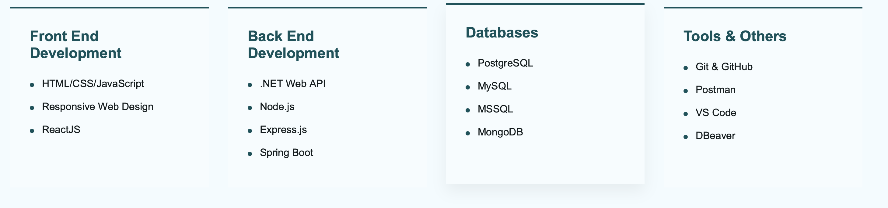
- CSS variables (pre - defined to maintain color codes across the application)
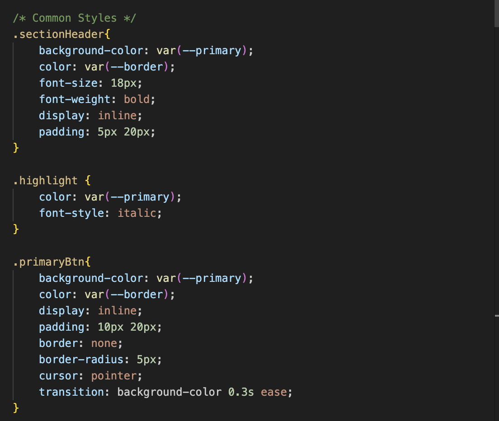
- Utility classes (for reusable styling patterns)
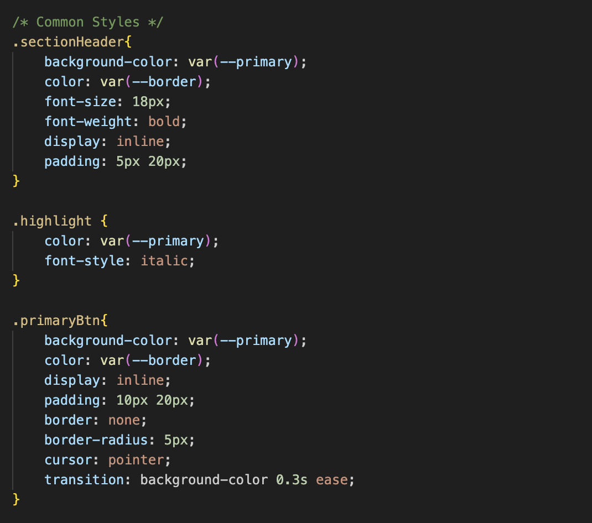
- Responsive Design (media queires)
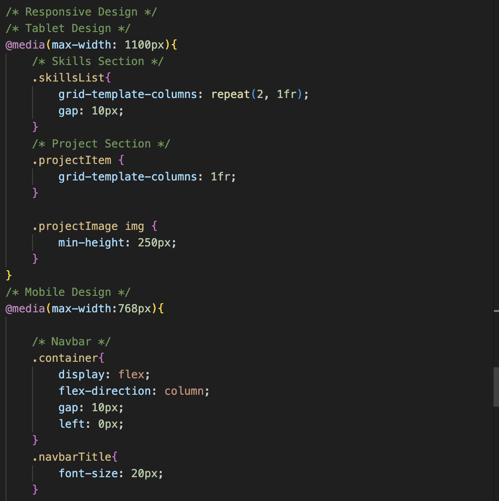
---
# Output Screenshots

# About Section
- Laptop
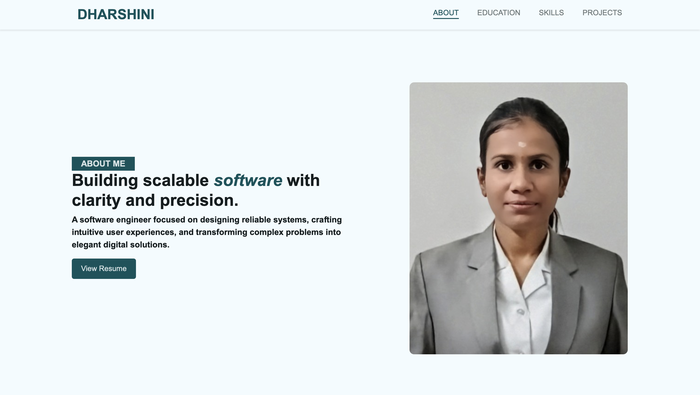
- Mobile

---
# Education Section
- Laptop
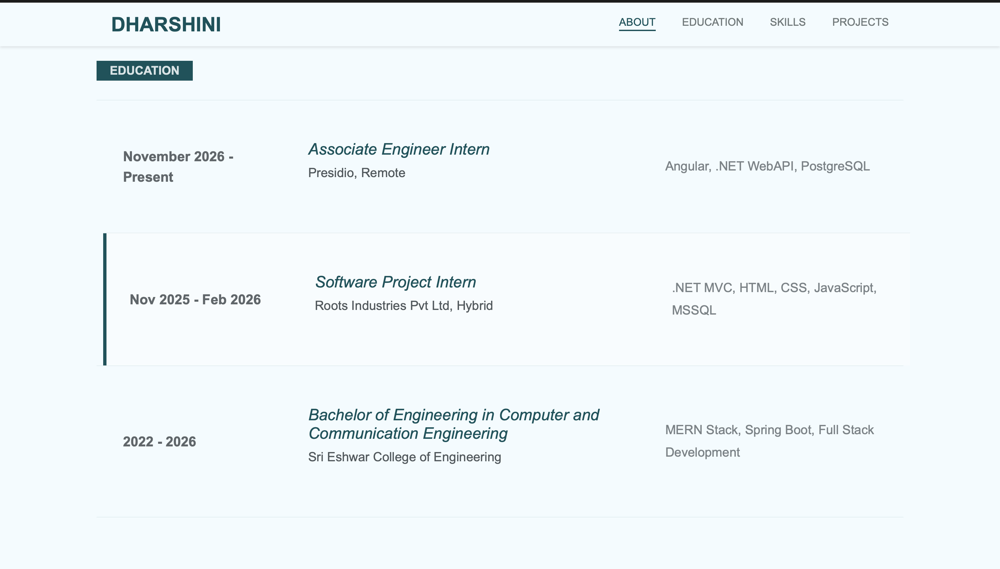
- Mobile
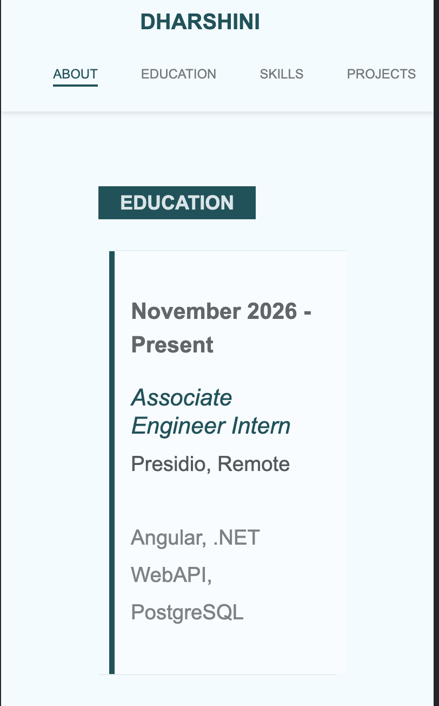
---
# Skills Section
- Laptop
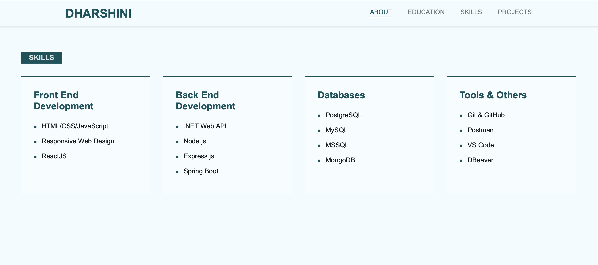
- Mobile
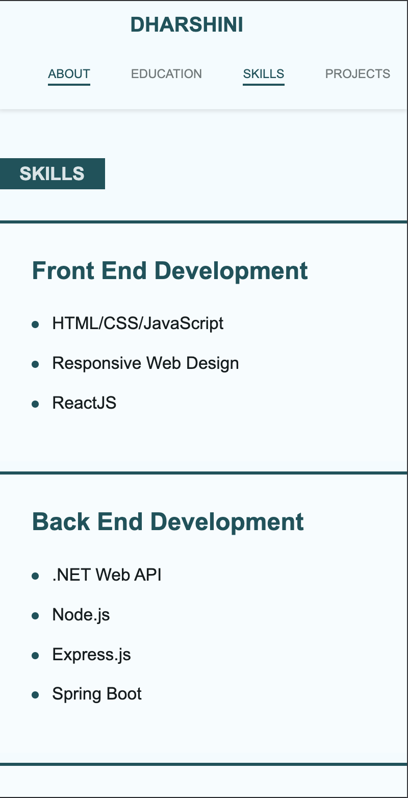
---
# Projects Section
- Laptop
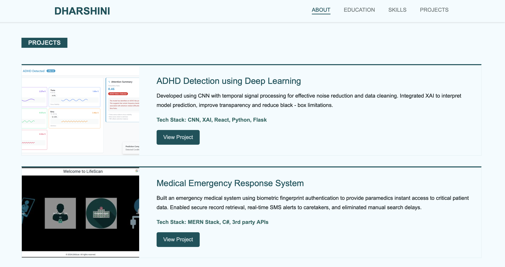
- Mobile
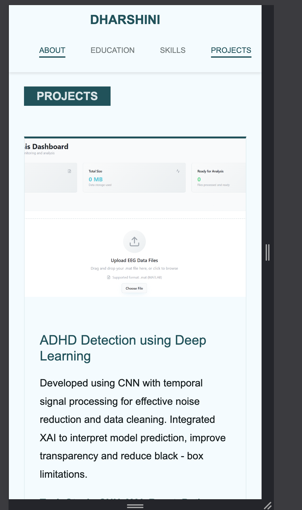
