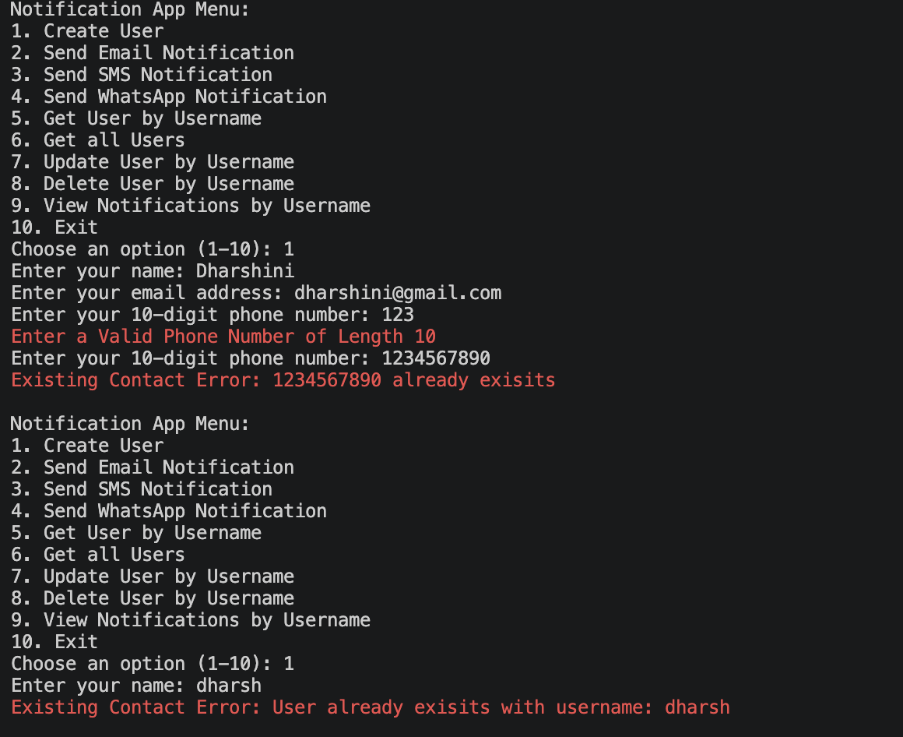
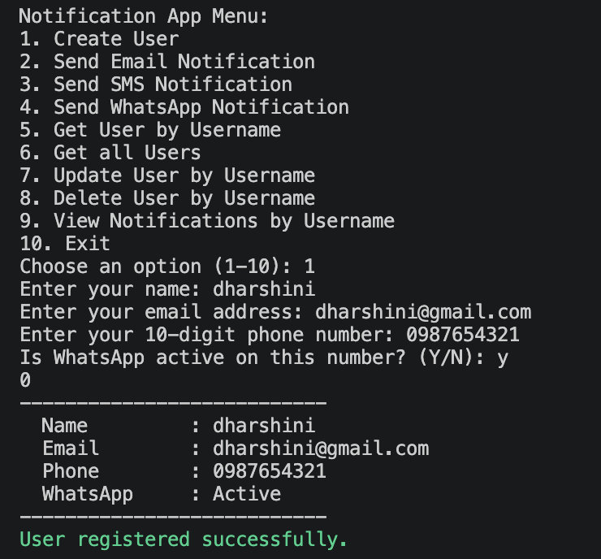
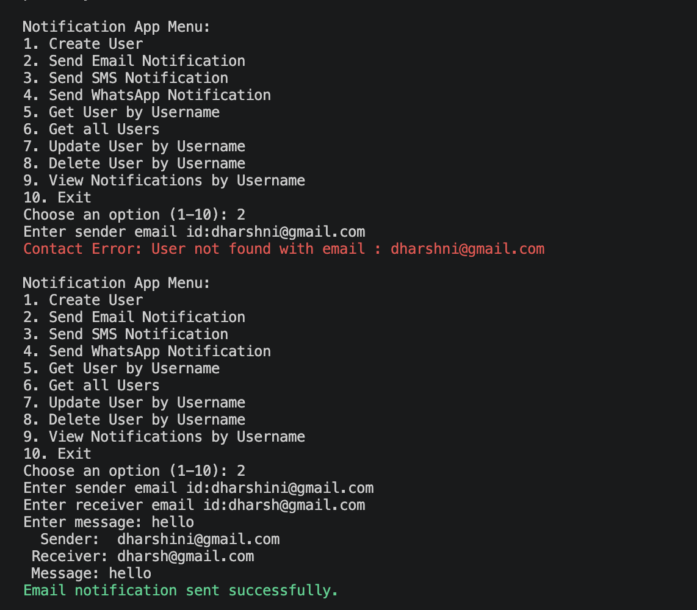
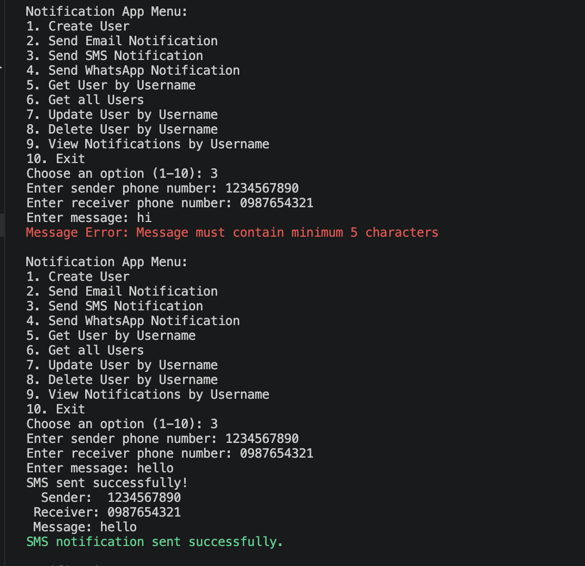
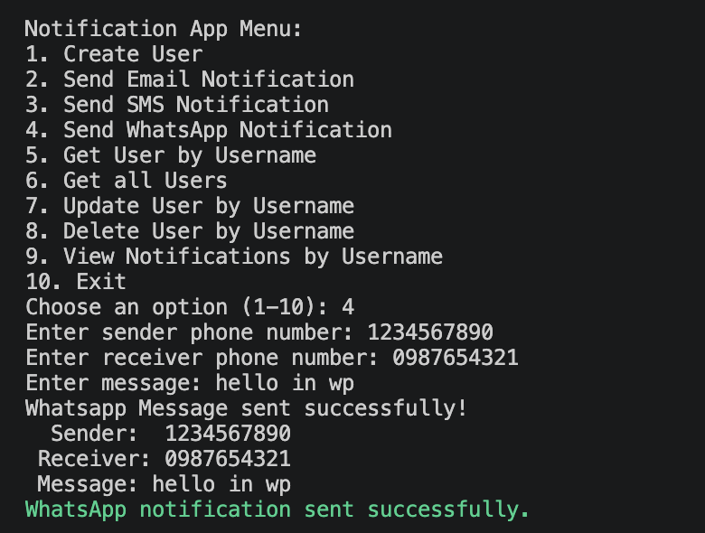
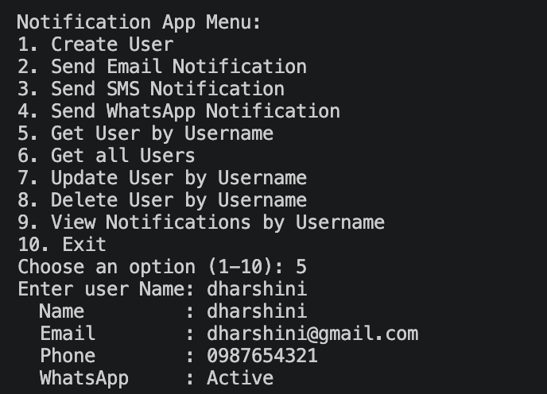
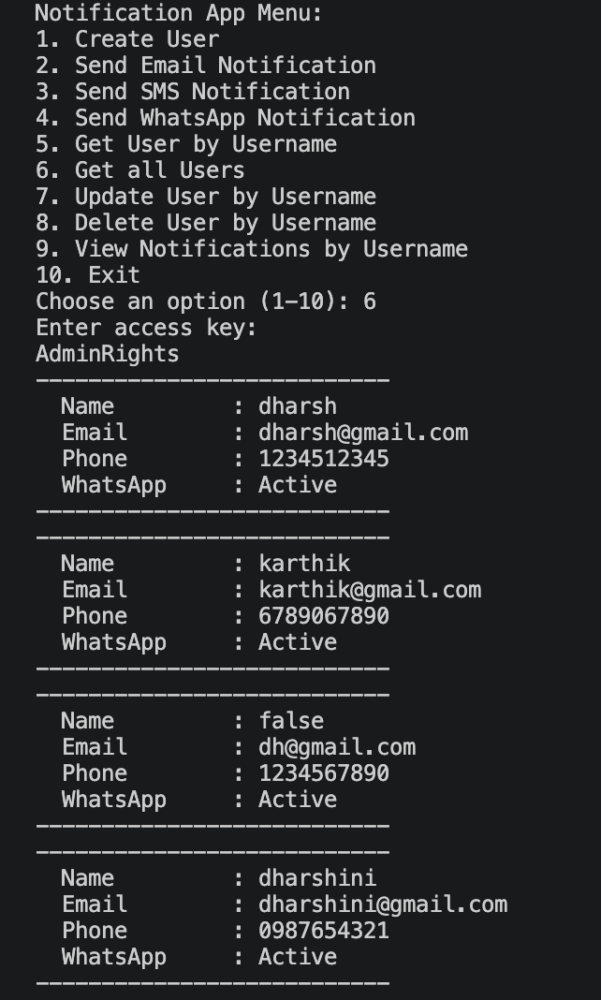
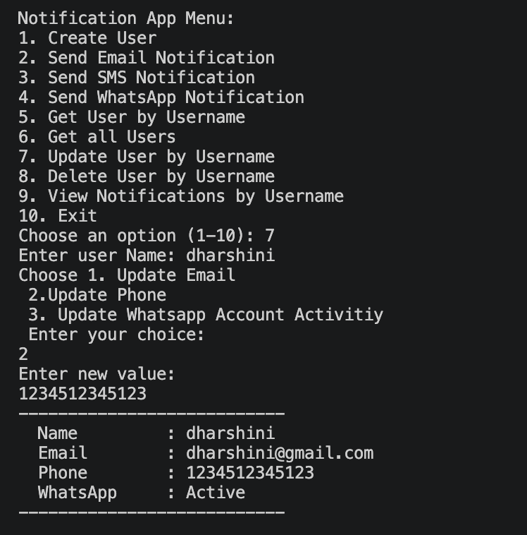

**NOTIFICATION SYSTEM**
**PROJECT OUTPUT**
1) REGISTRATION : User name, email and phone no are received.
Validations: 
* email and phone format validation
* Existing user check wrt name, email and phone

2) Send Email Notification
* Validation: Exisiting contact check wrt to email, message min characters validation

3) SMS Notification
* Validation: Exisiting contact check wrt phone, message min characters validation

4) Whatsapp Notification
* Validation: Exisiting contact validation -> IsWhatsappActive? validation -> Message min characters validation

5) Get User by name
* Validation: Exisiting contact check

6) Get all user
* Validation: Password based retrieval (only admin can get all user details)

7) Update User : User can update email, phone and whatsapp status (Active / Inactive)
* Validation: Exiting contact check -> Format check of new value
