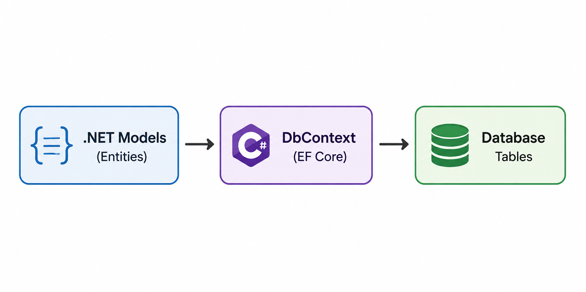
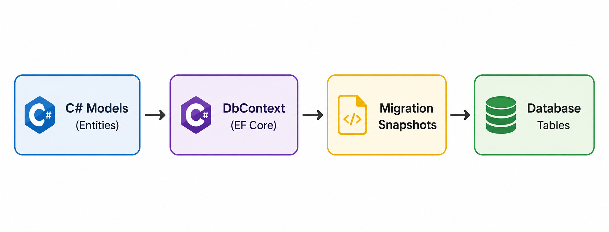

# Entity Framework Core (EF Core) Overview

Entity Framework Core (EF Core) is an **Object-Relational Mapper (ORM)** for .NET, enabling developers to work with a database using .NET objects and eliminating the need for most of the data-access code that they usually need to write.

---

## EF Core Development Approaches

There are two primary approaches for building .NET applications with EF Core: **Code-First** and **Database-First** (Database-First).

---

### 1. Code-First Approach



> [!NOTE]
> **When To Use** : Use for new projects where db schema is not defined and you want full control over models.

####  Step-by-Step Workflow

1. **Define Domain Entities:**
   Create standard C# classes representing your tables.

2. **Create the Database Context (`DbContext`):**
   Inherit from `DbContext` to manage database connections and configure entity mappings.


3. **Manage the Database using Migrations (CLI Commands):**
   Open your terminal in the project directory and run:

   ```bash
   # 1. Install EF Core tools globally (if not already installed)
   dotnet tool install --global dotnet-ef

   #2. Install EF Core package(Nuget Package Manager)
   dotnet add package Microsoft.EntityFrameworkCore

   #3. Migration Commands
   dotnet add package Microsoft.EntityFrameworkCore.Tools

   #4. Reads FluentAPI and converts to the Migrations code
   dotnet add package Microsoft.EntityFrameworkCore.Design

   #5. DB Provider package (PostgreSQL)
   dotnet add package Npgsql.EntityFrameworkCore.PostgreSQL

   #6. Add an initial migration to translate models into database schema instructions
   dotnet ef migrations add InitialCreate

   #7. Apply the migrations to create/update the actual database
   dotnet ef database update
   ```

---

### 2. Database-First Approach

In the **Database-First** approach, the existing database is the single source of truth. You design and maintain your database directly in PostgreSQL, SQL Server, or another DBMS, and then use EF Core tools to **scaffold** (reverse-engineer) your C# models and `DbContext` from the database.

> [!TIP]
> This approach is ideal for brownfield (existing) projects, working with legacy databases, or when database design is managed exclusively by a separate Database Administrator (DBA) team.

#### 🚶‍♂️ Step-by-Step Workflow

1. **Ensure Database Exists:**
   Create and design your database schema (e.g., tables, keys, indexes) directly inside PostgreSQL or your database of choice.

2. **Install Required NuGet Packages:**
   Ensure you have the design and database provider packages installed in your project:
   ```bash
   dotnet add package Microsoft.EntityFrameworkCore.Design
   dotnet add package Npgsql.EntityFrameworkCore.PostgreSQL # Use appropriate provider
   ```

3. **Run the Scaffolding Command:**
   Run the reverse-engineering CLI command to automatically inspect the database schema and generate matching model files and `DbContext`:

   ```bash
   dotnet ef dbcontext scaffold "Host=localhost;Port=5432;Database=bankDB;Username=postgres;Password=12345" Npgsql.EntityFrameworkCore.PostgreSQL -o Models -c BankingContext --context-dir Contexts
   ```

   *Parameters explained:*
   *   `"Host=..."`: The connection string to your database.
   *   `Npgsql.EntityFrameworkCore.PostgreSQL`: The database provider package.
   *   `-o Models`: The output directory for the generated entities.
   *   `-c BankingContext`: The name of the generated `DbContext` class.
   *   `--context-dir Contexts`: The output directory for the context file.

---

## 📊 Comparison: Code-First vs. Database-First

| Feature | Code-First Approach | Database-First Approach |
| :--- | :--- | :--- |
| **Source of Truth** | C# Code (Entities & Mappings) | Database Schema |
| **Control** | Full control over clean object-oriented C# models. | Full control over database optimization, indexes, and keys. |
| **Database Changes** | Modified in C#, applied to database via `dotnet ef migrations add` & `database update`. | Modified in database directly, then regenerated using `dotnet ef dbcontext scaffold`. |
| **Best Suited For** | - New (greenfield) projects.<br>- Projects without a dedicated DBA.<br>- Developers who prefer writing code over SQL. | - Existing (brownfield) or legacy databases.<br>- Databases managed by dedicated DBA teams.<br>- Rapid prototyping from a pre-built schema. |
| **Learning Curve** | Higher at first (need to understand Migrations, Data Annotations, Fluent API configuration). | Lower (scaffolding command does almost all the work automatically). |

---

## ⚡ Essential EF Core Features & Configurations

### Model Configuration: Data Annotations vs. Fluent API

You can configure how models map to database tables using two techniques:

1. **Data Annotations (Attribute-based):**
   Applying attributes directly onto entity classes and properties.
   ```csharp
   [Table("tbl_customer")]
   public class Customer {
       [Key]
       public int Id { get; set; }
       
       [Required]
       [MaxLength(100)]
       public string Name { get; set; }
   }
   ```

2. **Fluent API (Code-based):**
   Using method chaining inside `OnModelCreating` in the `DbContext`. This is the preferred method because it keeps model classes clean and free of database-specific dependencies.
   ```csharp
   protected override void OnModelCreating(ModelBuilder modelBuilder)
   {
       modelBuilder.Entity<Customer>()
           .ToTable("tbl_customer");
           
       modelBuilder.Entity<Customer>()
           .HasKey(c => c.Id);
           
       modelBuilder.Entity<Customer>()
           .Property(c => c.Name)
           .IsRequired()
           .HasMaxLength(100);
   }
   ```

### Querying with LINQ (Eager Loading Example)

Retrieve data efficiently using Linq-to-Entities:

```csharp
using (var context = new BankingContext())
{
    // Retrieve a customer and eagerly load their related accounts in a single query
    var customer = context.Customers
                          .Include(c => c.Accounts)
                          .FirstOrDefault(c => c.Id == 101);
                          
    if (customer != null)
    {
        Console.WriteLine($"Customer: {customer.Name}");
        foreach (var account in customer.Accounts)
        {
            Console.WriteLine($" - Account: {account.AccountNumber}, Balance: {account.Balance}");
        }
    }
}
```
## Key Advantages of EF Core

Using EF Core in modern .NET applications provides numerous benefits:

*   **High Productivity:** Eliminates the need to write repetitive, boilerplate ADO.NET code (opening connections, executing readers, parsing results).
*   **LINQ Integration (Language Integrated Query):** Allows you to write strongly-typed queries in C# rather than writing SQL as raw strings. The compiler checks your queries for type safety.
*   **Database Provider Model:** Support for a wide variety of relational and non-relational database providers including **PostgreSQL**, **Microsoft SQL Server**, **MySQL**, **SQLite**, and **Cosmos DB**. Switching databases is often as simple as changing the provider configuration.
*   **Automated Schema Management (Migrations):** Keeps your database schema synchronized with your C# models automatically.
*   **Change Tracking:** Automatically tracks changes made to your domain objects and saves them to the database when `SaveChanges()` is called.
*   **Eager, Lazy, and Explicit Loading:** Gives developers fine-grained control over how and when related entities are loaded from the database.

---
