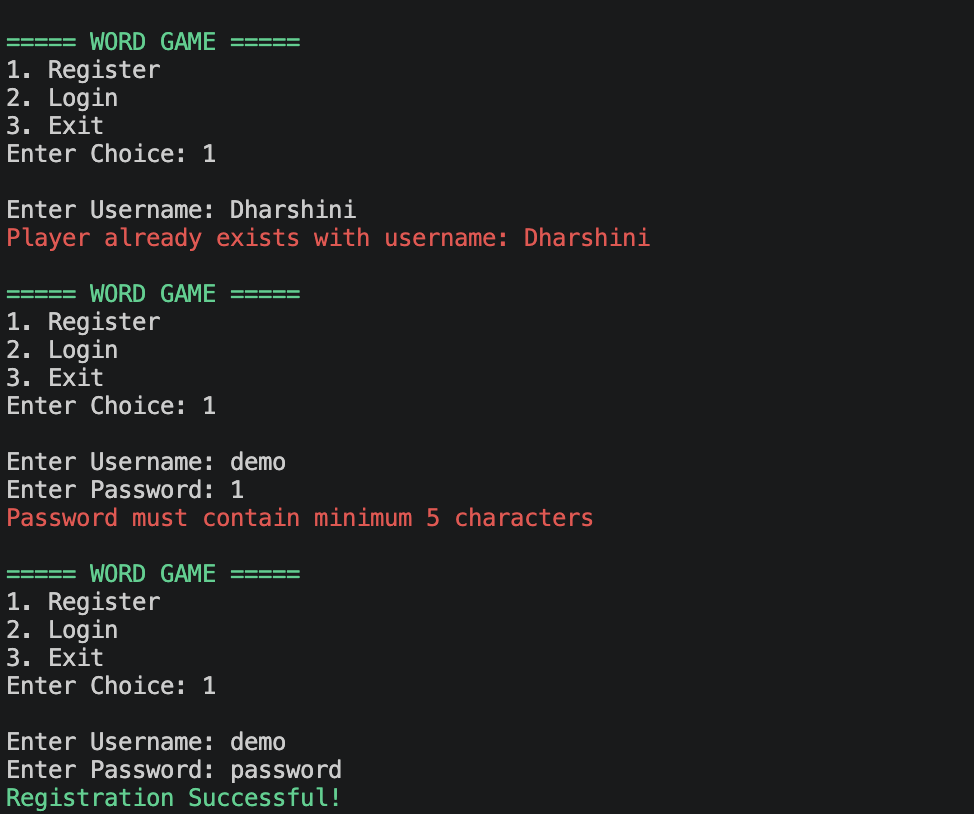
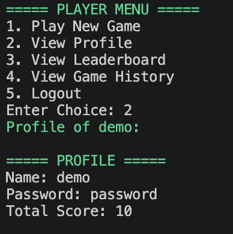
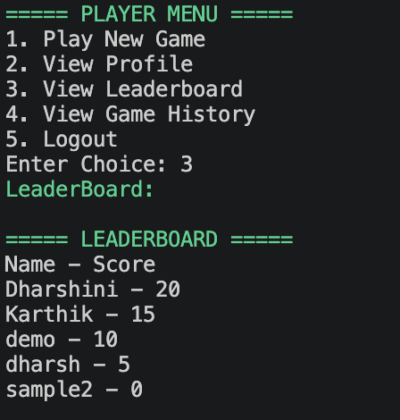
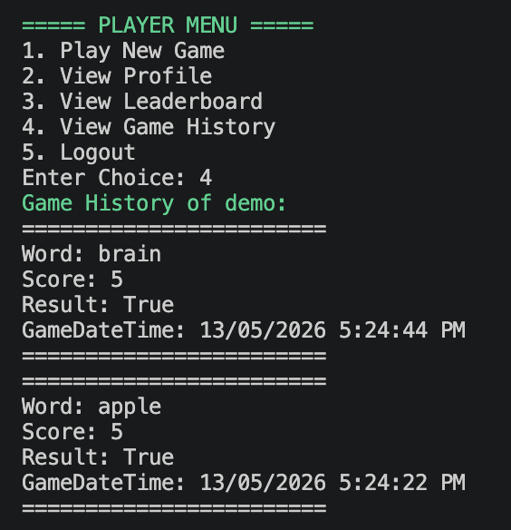
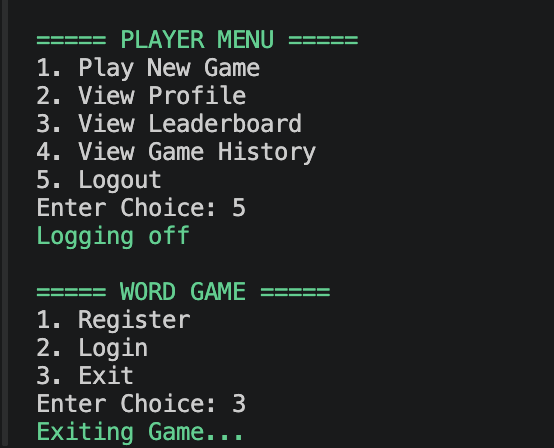

**WORD GAME**
**PROJECT OVERVIEW**
This is a console - based word guessing game where each user gets 5 guesses.

**WorkFlow:**
Program.cs -> Services -> Repository, Models -> DbContext -> DB

**PROJECT OUTPUT**
1) Player Registration with Player Validation (check if already exisits) and Password Validation

2) Login with Username and Password

3) Player Menu Shown only after Login.

4) New Game

G -> Correct letter at correct position
Y -> Correct letter but at wrong position
X -> Wrong letter

5) View Profile

6) View Leaderboard

7) View Game History

8) Log Out Option

**Models**
1) Player : Id, Name , Password, TotalScore
2) Word: Id, WordName
3) Game: Id, PlayerId, WordId, Score, GameTime (stored in db)
         Previous guess list, Attempts (temp storage)

**Modules**
1) Player : 
* Register
* Log in / Log out
* Play new Game
* View Profile
* View Leaderboard

2) Word: No Admin Module (As of now, no modules created)

3) Game: 
* Create New Game, Check Guess
* Print Coloured Feedback for each guess
* Print victory message with respect to attempt
* View Game History

**DB Connection Architecture:** ADO.NET

