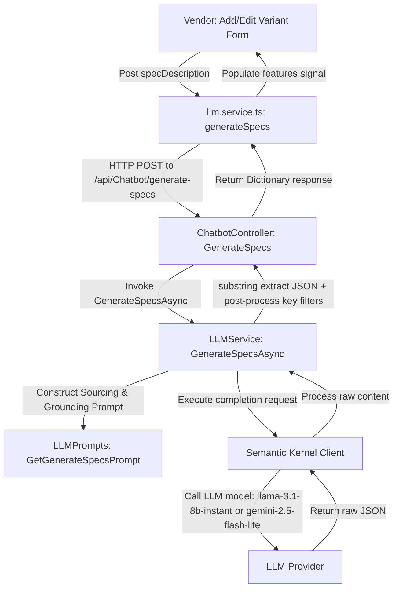

# AI Specification Generation Feature

This document explains the design, architecture, and operation of the AI-powered technical specification generation feature implemented for the vendor variant form.

---

## 1. Overview
When vendors create or update product variants, manually typing multiple technical features (such as Processor, RAM, Storage, and Display) is slow and error-prone. The **AI Spec Assistant** solves this by allowing vendors to enter a raw, unorganized textual description of the specifications (e.g. copied from a manufacturer datasheet). The AI then parses, standardizes, and extracts structured key-value pairs (Available Values), which the vendor can verify, edit, or delete before saving.

---

## 2. Technical Architecture

### Component Diagram


---

## 3. Grounding & Sourcing Rules
To ensure the LLM generates accurate and valid specification pairs, we define strict rules inside the prompt:

1. **Context Priority**: The LLM relies primarily on the provided inputs (`ProductName`, `ProductDescription`, `SpecDescription`).
2. **General Knowledge Guardrails**: Live internet searches are skipped. The model may supplement the given text using pre-trained product knowledge (e.g. converting a processor model SKU like "i3-100U" to "i3 14th Gen, 6 Cores, up to 4.7 GHz") **ONLY** if it has high confidence.
3. **Accuracy over Completeness**: If details are missing or cannot be inferred, the LLM omits the keys instead of fabricating values or outputting placeholders (like `N/A` or `-`).
4. **Source Conflicts**: If fields conflict across sources (e.g. contradictory colors or processor details), the Spec Description is preferred as the technical authority. Conflict signals imply different variants, so the conflicting field is omitted entirely rather than guessed.

---

## 4. Implementation Details

### A. Frontend UI (`add-variant.html` / `add-variant.css`)
- **Embedded Button Layout**: The text area and the crimson-gradient rounded "Generate Spec" pill button are wrapped inside a relative-positioned container (`.spec-input-container`).
- **Visual Styles**: Features a crimson/red focus boundary and gradient background styled similarly to a premium "Smart Write" box.
- **Service call**: Interacts with the `LLMService` wrapper (`llm.service.ts`) using the standard `/api/Chatbot/generate-specs` endpoint.
- **Key Sanitization**: Filters out any empty-string keys from the mapped features array:
  ```typescript
  const entries = Object.entries(specs).filter(([key]) => key.trim() !== '');
  ```

### B. Backend API (`ChatbotController.cs`)
- **Route**: `POST api/Chatbot/generate-specs`
- **Authorization**: Restricts execution to users with the `Vendor` role.

### C. LLM Service & Parsers (`LLMService.cs`)
- **Model Selection**: 
  - Uses highly efficient, fast, lightweight models to speed up responses and save costs (`llama-3.1-8b-instant` for Groq, `"gemini-2.5-flash-lite"` for Gemini).
- **History Isolation**: Unlike chat messaging, requests to generate specs do **not** write to session history or store messages in the database.
- **Robust JSON Extraction**: Rather than relying strictly on the LLM formatting constraints, the service extracts the substring between the first `{` and the last `}`. This avoids formatting failures if the LLM includes conversational preambles or markdown backticks:
  ```csharp
  var firstBrace = content.IndexOf('{');
  var lastBrace = content.LastIndexOf('}');
  if (firstBrace != -1 && lastBrace != -1 && lastBrace > firstBrace)
  {
      content = content.Substring(firstBrace, lastBrace - firstBrace + 1);
  }
  ```
- **Post-processing Filter**: Removes any whitespace keys or empty strings from the deserialized C# `Dictionary<string, string>` before returning the response.
