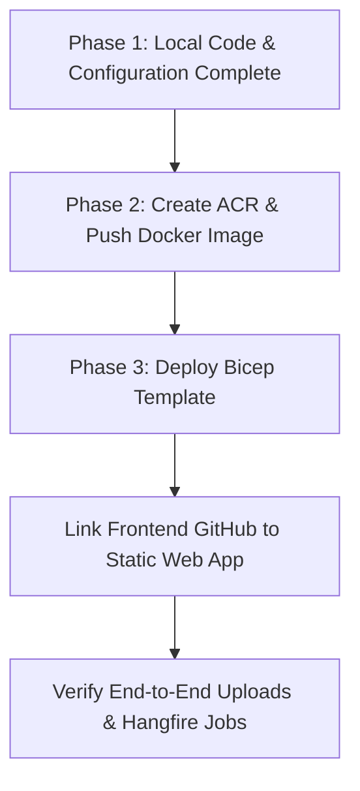

# Azure Deployment Runbook: Step-by-Step Guide (Bicep Edition)
**Angular Frontend (Static Web Apps) + .NET 10 Web API & Hangfire (Container Apps) + PostgreSQL + Key Vault + Blob Storage**

---

## Table of Contents

- [Overview of Steps](#overview-of-steps)
- [Phase 1: Local Codebase Modifications](#phase-1-local-codebase-modifications)
  - [Step 1.1: Add NuGet Packages for Key Vault and Blob Storage](#step-11-add-nuget-packages-for-key-vault-and-blob-storage)
  - [Step 1.2: Implement Azure Blob Storage Service](#step-12-implement-azure-blob-storage-service)
  - [Step 1.3: Update UploadController to Use Blob Storage](#step-13-update-uploadcontroller-to-use-blob-storage)
  - [Step 1.4: Update Program.cs for Azure Key Vault Configuration](#step-14-update-programcs-for-azure-key-vault-configuration)
  - [Step 1.5: Add Dockerfile to Project Root](#step-15-add-dockerfile-to-project-root)
  - [Step 1.6: Configure Angular Production Environment](#step-16-configure-angular-production-environment)
- [Phase 2: Preparing Registry & Local Docker Context](#phase-2-preparing-registry--local-docker-context)
  - [Step 2.1: Login to Azure & Create Resource Group](#step-21-login-to-azure--create-resource-group)
  - [Step 2.2: Create Azure Container Registry (ACR)](#step-22-create-azure-container-registry-acr)
  - [Step 2.3: Build & Push the Docker Image](#step-23-build--push-the-docker-image)
- [Phase 3: Provisioning & Deployment via Azure Bicep](#phase-3-provisioning--deployment-via-azure-bicep)
  - [Step 3.1: Create the Bicep Resource Template](#step-31-create-the-bicep-resource-template)
  - [Step 3.2: Execute Bicep Deployment](#step-32-execute-bicep-deployment)
  - [Step 3.2b: Configure Ingress Sticky Sessions for SignalR](#step-32b-configure-ingress-sticky-sessions-for-signalr)
  - [Step 3.3: Deploy Angular via Azure Static Web Apps](#step-33-deploy-angular-via-azure-static-web-apps)
  - [Step 3.4: Final End-to-End Verification](#step-34-final-end-to-end-verification)

---

## Overview of Steps

This revised runbook transitions the infrastructure provisioning from individual imperatively run commands into a declarative **Azure Bicep** execution. Steps 1.1 through 1.4 have been completed. 

Here is the high-level roadmap of the remaining steps:



### ShopHive Deployment Architecture


---

## Phase 1: Local Codebase Modifications

> [!NOTE]
> The steps below (1.1 to 1.4) are preserved exactly as executed.

### Step 1.1: Add NuGet Packages for Key Vault and Blob Storage
**Objective:** Add SDKs required to authenticate securely via Azure Managed Identities and connect to Azure Services.

Run these terminal commands from the directory of your API project:
```bash
# Navigate to the API project directory
cd backend/Ecommerce.API

# Add package for Azure Key Vault Configuration Integration
dotnet add package Azure.Extensions.Configuration.Secrets

# Add package for Azure Blob Storage Integration
dotnet add package Azure.Storage.Blobs

# Add package for Azure Identity (DefaultAzureCredential)
dotnet add package Azure.Identity
```

### Step 1.2: Implement Azure Blob Storage Service
**Objective:** Add an abstraction layer to decouple file management from the local directory system.

1. **Add Interface:** Create a new file under `backend/Ecommerce.Contracts/Services/IBlobStorageService.cs` containing:
```csharp
using System.IO;
using System.Threading.Tasks;

namespace Ecommerce.Contracts.Services
{
    public interface IBlobStorageService
    {
        Task<string> UploadFileAsync(Stream fileStream, string fileName, string containerName, string contentType);
        Task DeleteFileAsync(string fileUrl, string containerName);
    }
}
```

2. **Add Implementation:** Create a new file under `backend/Ecommerce.BLL/AzureBlobStorageService.cs` containing:
```csharp
using Azure.Identity;
using Azure.Storage.Blobs;
using Azure.Storage.Blobs.Models;
using Ecommerce.Contracts.Services;
using Microsoft.Extensions.Configuration;
using System;
using System.IO;
using System.Threading.Tasks;

namespace Ecommerce.BLL
{
    public class AzureBlobStorageService : IBlobStorageService
    {
        private readonly BlobServiceClient _blobServiceClient;

        public AzureBlobStorageService(IConfiguration configuration)
        {
            // Try reading Connection String first (needed for Contributor role without role-assignment access)
            string connectionString = configuration["AzureStorage:ConnectionString"];
            if (!string.IsNullOrEmpty(connectionString))
            {
                _blobServiceClient = new BlobServiceClient(connectionString);
                return;
            }

            // Fallback: Read storage service account endpoint from configuration (uses Managed Identity)
            string blobUri = configuration["AzureStorage:BlobServiceUri"];
            if (string.IsNullOrEmpty(blobUri))
            {
                throw new ArgumentNullException("AzureStorage:ConnectionString or AzureStorage:BlobServiceUri is missing.");
            }

            _blobServiceClient = new BlobServiceClient(new Uri(blobUri), new DefaultAzureCredential());
        }

        public async Task<string> UploadFileAsync(Stream fileStream, string fileName, string containerName, string contentType)
        {
            var containerClient = _blobServiceClient.GetBlobContainerClient(containerName);
            await containerClient.CreateIfNotExistsAsync(PublicAccessType.Blob);

            var blobClient = containerClient.GetBlobClient(fileName);
            var options = new BlobUploadOptions
            {
                HttpHeaders = new BlobHttpHeaders { ContentType = contentType }
            };

            await blobClient.UploadAsync(fileStream, options);
            return blobClient.Uri.ToString(); // Returns absolute URL to store in Database
        }

        public async Task DeleteFileAsync(string fileUrl, string containerName)
        {
            var containerClient = _blobServiceClient.GetBlobContainerClient(containerName);
            var uri = new Uri(fileUrl);
            var fileName = Path.GetFileName(uri.LocalPath);

            var blobClient = containerClient.GetBlobClient(fileName);
            await blobClient.DeleteIfExistsAsync();
        }
    }
}
```

3. **Register the Service:** In `backend/Ecommerce.API/Program.cs`, register the service dependencies under the `#region Service`:
```csharp
builder.Services.AddScoped<IBlobStorageService, AzureBlobStorageService>();
```

### Step 1.3: Update UploadController to Use Blob Storage
**Objective:** Replace local `wwwroot` physical directory writing with Blob Storage uploads.

Modify `backend/Ecommerce.API/Controllers/UploadController.cs` to inject `IBlobStorageService` and replace physical file saving with Azure storage uploads:

```csharp
// Update fields and constructor:
private readonly IProductVariantService _variantService;
private readonly IBlobStorageService _blobStorageService;

public UploadController(IProductVariantService variantService, IBlobStorageService blobStorageService)
{
    _variantService = variantService;
    _blobStorageService = blobStorageService;
}

// Inside UploadReviewImage method:
// Replace the physical FileStream copy with:
using (var stream = file.OpenReadStream())
{
    // Uploads file directly to 'reviews' blob container
    string blobUrl = await _blobStorageService.UploadFileAsync(stream, fileName, "reviews", file.ContentType);
    return Ok(new { imageUrl = blobUrl });
}

// Inside UploadProductVariantImage method:
// Replace the physical Image.SaveAsWebp(filePath) logic with:
using (var sourceStream = file.OpenReadStream())
using (var ms = new MemoryStream())
{
    await sourceStream.CopyToAsync(ms);
    ms.Position = 0;
    using (var image = Image.Load(ms))
    using (var outputMs = new MemoryStream())
    {
        image.SaveAsWebp(outputMs);
        outputMs.Position = 0;
        
        // Uploads image to 'products' blob container
        string blobUrl = await _blobStorageService.UploadFileAsync(outputMs, fileName, "products", "image/webp");
        
        await _variantService.AddImage(variantId, new CreateProductImageRequest
        {
            ImageUrl = blobUrl,
            ImageOrder = imageNo
        });

        return Ok(new { imageUrl = blobUrl });
    }
}
```

### Step 1.4: Update Program.cs for Azure Key Vault Configuration
**Objective:** Instruct the application to fetch configuration parameters directly from Key Vault in cloud environments.

At the beginning of `backend/Ecommerce.API/Program.cs` (right after creating `builder` on line 24), configure Key Vault using your managed identity credentials:

```csharp
if (!builder.Environment.IsDevelopment())
{
    var keyVaultUrl = builder.Configuration["KeyVault:VaultUri"];
    if (!string.IsNullOrEmpty(keyVaultUrl))
    {
        builder.Configuration.AddAzureKeyVault(new Uri(keyVaultUrl), new DefaultAzureCredential());
    }
}
```

### Step 1.4b: Update Program.cs for Dynamic CORS Configuration
**Objective:** Support allowed CORS origins dynamically loaded from configuration to allow production frontend Static Web App domains.

Update the CORS configuration policy in `backend/Ecommerce.API/Program.cs` (replacing the hardcoded `http://localhost:4200` policy):

```csharp
#region CORS
var allowedOrigins = builder.Configuration["Cors:AllowedOrigins"]?.Split(',') ?? new[] { "http://localhost:4200" };
builder.Services.AddCors(options =>
{
    options.AddPolicy("AllowAngular", policy =>
    {
        policy.WithOrigins(allowedOrigins)
              .AllowAnyHeader()
              .AllowAnyMethod()
              .AllowCredentials();
    });
});
#endregion
```

### Step 1.5: Add Dockerfile to Project Root
**Objective:** Package the backend files inside a Docker container image.

Create a file named `Dockerfile` under the `backend` folder:
```dockerfile
FROM mcr.microsoft.com/dotnet/aspnet:10.0 AS base
WORKDIR /app
EXPOSE 8080

FROM mcr.microsoft.com/dotnet/sdk:10.0 AS build
WORKDIR /src
COPY ["Ecommerce.API/Ecommerce.API.csproj", "Ecommerce.API/"]
COPY ["Ecommerce.BLL/Ecommerce.BLL.csproj", "Ecommerce.BLL/"]
COPY ["Ecommerce.DAL/Ecommerce.DAL.csproj", "Ecommerce.DAL/"]
COPY ["Ecommerce.Models/Ecommerce.Models.csproj", "Ecommerce.Models/"]
COPY ["Ecommerce.Contracts/Ecommerce.Contracts.csproj", "Ecommerce.Contracts/"]
COPY ["Ecommerce.Shared/Ecommerce.Shared.csproj", "Ecommerce.Shared/"]
RUN dotnet restore "Ecommerce.API/Ecommerce.API.csproj"
COPY . .
WORKDIR "/src/Ecommerce.API"
RUN dotnet build "Ecommerce.API.csproj" -c Release -o /app/build

FROM build AS publish
RUN dotnet publish "Ecommerce.API.csproj" -c Release -o /app/publish /p:UseAppHost=false

FROM base AS final
WORKDIR /app
COPY --from=publish /app/publish .
ENTRYPOINT ["dotnet", "Ecommerce.API.dll"]
```

### Step 1.6: Configure Angular Production Environment
**Objective:** Configure your client application to direct requests to the new public domain.

Modify the file `frontend/src/environments/environment.prod.ts`:
```typescript
export const environment = {
  production: true,
  apiUrl: 'https://ecommerce-api.azurecontainerapps.io' // Replace with actual Container App FQDN after Step 3.2
};
```

---

## Phase 2: Preparing Registry & Local Docker Context

### Step 2.1: Login to Azure & Create Resource Group
**Objective:** Establish CLI authentication and create the deployment scope.

```bash
# Start authentication flow
az login

# Set the active subscription context
az account set --subscription "Your-Subscription-Name-Or-Id"

# Create the target Resource Group in East US
az group create --name rg-ecommerce-prod --location eastus
```
[Screenshot Placeholder: Terminal showing successful Azure CLI login profile]

---

### Step 2.2: Create Azure Container Registry (ACR)
**Objective:** Provision the registry to hold the backend Docker image. 

*(We create this resource first via CLI so we can push our build image before Bicep attempts to spin up the Container App referencing it).*

```bash
# Create ACR (Basic SKU is lowest cost)
az acr create \
  --resource-group rg-ecommerce-prod \
  --name acrecommerceprod2026 \
  --sku Basic \
  --admin-enabled true

# open and run docker engine to login

# Login to ACR locally . Use Azure creds to login in to acr which returns tem token using which docker can push images to acr
az acr login --name acrecommerceprod2026
```
[Screenshot Placeholder: ACR login confirmation status]

---

### Step 2.3: Build & Push the Docker Image
**Objective:** Push the compiled API code to ACR.

```bash
# Navigate to the backend folder (containing the Dockerfile)
cd backend

# Remove keys from appsettings.json

# Build the .NET API Docker image locally
docker build -t acrecommerceprod2026.azurecr.io/ecommerce-api:v1 .

# Push the built image to ACR registry
docker push acrecommerceprod2026.azurecr.io/ecommerce-api:v1
```
[Screenshot Placeholder: Command output showing docker push layer progress]

---

## Phase 3: Provisioning & Deployment via Azure Bicep

### Step 3.1: Create the Bicep Resource Template
**Objective:** Define the declarative infrastructure state.

Create a file named `main.bicep` inside your `azure-bicep/` directory with the following definitions:

```bicep
param location string = resourceGroup().location
param keyVaultName string = 'shophive-kv'
param storageAccountName string = 'shophive'
param postgresServerName string = 'shophive-db'
param postgresAdminUser string = 'shophiveadmin'
@secure()
param postgresAdminPassword string
param containerRegistryName string = 'shophiveacr'
param containerAppName string = 'shophive-api'
param staticWebAppName string = 'shophive-swa'

// 1. Storage Account & Blob Containers
resource storageAccount 'Microsoft.Storage/storageAccounts@2023-01-01' = {
  name: storageAccountName
  location: location
  kind: 'StorageV2'
  sku: { name: 'Standard_LRS' }
  properties: { allowBlobPublicAccess: true }
}

resource blobService 'Microsoft.Storage/storageAccounts/blobServices@2023-01-01' = {
  parent: storageAccount
  name: 'default'
}

resource productsContainer 'Microsoft.Storage/storageAccounts/blobServices/containers@2023-01-01' = {
  parent: blobService
  name: 'products'
  properties: { publicAccess: 'Blob' }
}

resource reviewsContainer 'Microsoft.Storage/storageAccounts/blobServices/containers@2023-01-01' = {
  parent: blobService
  name: 'reviews'
  properties: { publicAccess: 'Blob' }
}

resource logsContainer 'Microsoft.Storage/storageAccounts/blobServices/containers@2023-01-01' = {
  parent: blobService
  name: 'logs'
  properties: { publicAccess: 'None' } // Logs should be private
}

// 2. PostgreSQL Server & Configuration
resource postgresServer 'Microsoft.DBforPostgreSQL/flexibleServers@2023-03-01-preview' = {
  name: postgresServerName
  location: location
  sku: { name: 'Standard_B1ms', tier: 'Burstable' }
  properties: {
    administratorLogin: postgresAdminUser
    administratorLoginPassword: postgresAdminPassword
    version: '15'
    storage: { storageSizeGB: 32 }
    backup: { backupRetentionDays: 7, geoRedundantBackup: 'Disabled' }
  }
}

resource postgresDb 'Microsoft.DBforPostgreSQL/flexibleServers/databases@2023-03-01-preview' = {
  parent: postgresServer
  name: 'ecommercedb'
}

resource firewallRule 'Microsoft.DBforPostgreSQL/flexibleServers/firewallRules@2023-03-01-preview' = {
  parent: postgresServer
  name: 'AllowAllAzureIPs'
  properties: {
    startIpAddress: '0.0.0.0'
    endIpAddress: '0.0.0.0'
  }
}

// 3. Azure Key Vault & Secret Store
resource keyVault 'Microsoft.KeyVault/vaults@2023-07-01' = {
  name: keyVaultName
  location: location
  properties: {
    sku: { family: 'A', name: 'standard' }
    tenantId: subscription().tenantId
    enableSoftDelete: true
    accessPolicies: [] // Dynamically configured below
  }
}

resource secretDbConn 'Microsoft.KeyVault/vaults/secrets@2023-07-01' = {
  parent: keyVault
  name: 'ConnectionStrings--Default'
  properties: {
    value: 'Host=${postgresServer.properties.fullyQualifiedDomainName};Database=ecommercedb;Username=${postgresAdminUser};Password=${postgresAdminPassword};SSL Mode=Require;'
  }
}

resource secretStorageUri 'Microsoft.KeyVault/vaults/secrets@2023-07-01' = {
  parent: keyVault
  name: 'AzureStorage--BlobServiceUri'
  properties: {
    value: storageAccount.properties.primaryEndpoints.blob
  }
}

// 4. Container App Workspace & Environments
resource logAnalyticsWorkspace 'Microsoft.OperationalInsights/workspaces@2022-10-01' = {
  name: 'shophive-log'
  location: location
  properties: { sku: { name: 'PerGB2018' } }
}

resource containerAppEnv 'Microsoft.App/managedEnvironments@2023-05-01' = {
  name: 'shophive-env'
  location: location
  properties: {
    appLogsConfiguration: {
      destination: 'log-analytics'
      logAnalyticsConfiguration: {
        customerId: logAnalyticsWorkspace.properties.customerId
        sharedKey: logAnalyticsWorkspace.listKeys().primarySharedKey
      }
    }
  }
}

// Reference the pre-existing Container Registry for Pull authentication
resource containerRegistry 'Microsoft.ContainerRegistry/registries@2023-07-01' existing = {
  name: containerRegistryName
}

// 5. Container App Deployment
resource containerApp 'Microsoft.App/containerApps@2023-05-01' = {
  name: containerAppName
  location: location
  identity: {
    type: 'SystemAssigned'
  }
  properties: {
    managedEnvironmentId: containerAppEnv.id
    configuration: {
      ingress: {
        external: true
        targetPort: 8080
      }
      registries: [
        {
          server: '${containerRegistryName}.azurecr.io'
          identity: 'system' // Pulls securely using Container App System Identity
        }
      ]
    }
    template: {
      containers: [
        {
          name: 'shophive-api'
          image: '${containerRegistryName}.azurecr.io/shophive-api:v1'
          env: [
            {
              name: 'KeyVault__VaultUri'
              value: keyVault.properties.vaultUri
            }
          ]
          resources: {
            cpu: json('0.5')
            memory: '1.0Gi'
          }
        }
      ]
      scale: {
        minReplicas: 1
        maxReplicas: 2
      }
    }
  }
}

// 6. IAM Identity / Access Policy Declarations

// Role Assignment: Storage Account access
resource storageRole 'Microsoft.Authorization/roleAssignments@2022-04-01' = {
  name: guid(storageAccount.id, containerApp.id, 'StorageBlobDataContributor')
  scope: storageAccount
  properties: {
    roleDefinitionId: subscriptionResourceId('Microsoft.Authorization/roleDefinitions', 'ba92f5b4-2d11-453d-a403-e96b0029c9fe')
    principalId: containerApp.identity.principalId
    principalType: 'ServicePrincipal'
  }
}

// Role Assignment: Container App AcrPull rights
resource acrPullRole 'Microsoft.Authorization/roleAssignments@2022-04-01' = {
  name: guid(containerApp.id, 'AcrPull')
  scope: containerRegistry
  properties: {
    roleDefinitionId: subscriptionResourceId('Microsoft.Authorization/roleDefinitions', '7f951dda-4ed3-4680-a7ca-43fe172d538d')
    principalId: containerApp.identity.principalId
    principalType: 'ServicePrincipal'
  }
}

// Key Vault Policy Bindings
resource kvAccessPolicy 'Microsoft.KeyVault/vaults/accessPolicies@2023-07-01' = {
  parent: keyVault
  name: 'add'
  properties: {
    accessPolicies: [
      {
        tenantId: subscription().tenantId
        objectId: containerApp.identity.principalId
        permissions: { secrets: [ 'get', 'list' ] }
      }
    ]
  }
}

// 7. Static Web App (Frontend)
resource staticWebApp 'Microsoft.Web/staticSites@2023-01-01' = {
  name: staticWebAppName
  location: location
  sku: { name: 'Free', tier: 'Free' }
  properties: {}
}
```

---

### Step 3.2: Execute Bicep Deployment
**Objective:** Deploy all resources in one execution, automatically mapping links, policies, and passwords.

Run the following command to deploy the infrastructure:
```bash
az deployment group create \
  --resource-group rg-ecommerce-prod \
  --template-file azure-bicep/main.bicep \
  --parameters postgresAdminPassword="YourPostgresSecurePassword123!"
```
[Screenshot Placeholder: Bicep Deployment complete JSON output]

*Once complete, write down the generated `shophive-api` Container App domain URL (from output properties or Azure portal) to update your Angular prod environment file in Step 1.6.*

---

### Step 3.2b: Configure Ingress Sticky Sessions for SignalR
**Objective:** Enable session affinity (sticky sessions) on the Container App ingress to route traffic from a client to the same replica, preventing SignalR WebSocket connection handshakes from returning a `404 Not Found` across multiple replicas.

Run this command in your terminal:
```bash
az containerapp ingress sticky-sessions set \
  --name shophive-api \
  --resource-group shophive-rg \
  --affinity sticky
```

---

### Step 3.3: Deploy Angular via Azure Static Web Apps
**Objective:** Link the Static Web App to your repository code.

Navigate to the **Azure Portal**, locate `shophive-swa`, click **Manage Deployment Token**, copy the token, and add it to your GitHub Repository Secrets to automate builds via GitHub workflows.

---

### Step 3.4: Final End-to-End Verification
**Objective:** Confirm backend, jobs database, storage, and frontend communicate correctly.

1. **Verify API health:** Open `https://<your-container-app-url>/swagger` in your browser.
2. **Test File Uploads:** Upload a review or variant image. Verify that the image is served from the Azure Blob Storage URL (`https://shophive.blob.core.windows.net/...`).
3. **Verify Database:** Verify that image URL records in Postgres contain the absolute Azure Storage URL.
4. **Verify Hangfire:** Open the Hangfire Dashboard (`https://<url>/hangfire`) and check that background reservation jobs are enqueued correctly.

---

## Phase 4: Post-Deployment Data & Media Migration

### Step 4.1: Database Schema & Data Migration
**Objective:** Sync the PostgreSQL database schema and copy existing records.

1. **Apply EF Migrations to Azure Database:**
   First, add your local machine's public IP address to the PostgreSQL firewall rules to allow connections:
   ```bash
   # Fetch your local public IP
   DEVELOPER_IP=$(curl -s https://api.ipify.org)

   # Register the firewall rule on the database server
   az postgres flexible-server firewall-rule create \
     --resource-group shophive-rg \
     --server-name shophive-db \
     --name AllowLocalDevIP \
     --start-ip-address $DEVELOPER_IP \
     --end-ip-address $DEVELOPER_IP
   ```

   Then, run this local command to apply the EF migrations (use the password set during Bicep deployment):
   ```bash
   dotnet ef database update \
     --project backend/Ecommerce.DAL \
     --startup-project backend/Ecommerce.API \
     --connection "Host=shophive-db.postgres.database.azure.com;Database=ecommercedb;Username=shophiveadmin;Password=Postgres123*;SSL Mode=Require;"
   ```

2. **Dump and Restore Local Data (Optional):**
   If you have database records locally you want to migrate:
   ```bash
   # Export local data
   pg_dump -U postgres -d ecommercedb -F c -b -v -f local_db_backup.dump

   # Import it to Azure PostgreSQL
   pg_restore -h shophive-db.postgres.database.azure.com -U shophiveadmin -d ecommercedb -v local_db_backup.dump
   ```

---

### Step 4.2: Uploading Local Images to Blob Storage
**Objective:** Migrate your existing product and review images to Azure Blob.

Use **Azure Storage Explorer** or the **Azure CLI** to transfer your local `wwwroot/assets` content:
```bash
# Upload local product images to the 'products' container
az storage blob upload-batch \
  --account-name shophive \
  --destination products \
  --source backend/Ecommerce.API/wwwroot/assets/products \
  --overwrite

# Upload local review images to the 'reviews' container
az storage blob upload-batch \
  --account-name shophive \
  --destination reviews \
  --source backend/Ecommerce.API/wwwroot/assets/review \
  --overwrite
```
[Screenshot Placeholder: Storage Account blob container upload progress]

---

### Step 4.3: Transferring & Configuring Serilog Logs
**Objective:** Upload historical logs and configure the application to log directly to the private `logs` container.

1. **Upload Historical Logs:**
   If you want to archive your existing local logs on Azure:
   ```bash
   az storage blob upload \
     --account-name shophive \
     --container-name logs \
     --name "history/EcommerceLog_local.txt" \
     --file backend/Ecommerce.API/logs/EcommerceLog.txt
   ```

2. **Code Configuration for Serilog Azure Blob Sink (Optional):**
   To configure Serilog to write its active runtime logs directly to the new private `logs` container:
   * Install the package `Serilog.Sinks.AzureBlobStorage` to `Ecommerce.API.csproj`.
   * Register it in `Program.cs`:
     ```csharp
     .WriteTo.AzureBlobStorage(
         connectionString: builder.Configuration.GetConnectionString("Default"), // Or storage account connection string
         storageContainerName: "logs",
         storageFileName: "EcommerceLog_{yyyyMMdd}.txt"
     )
     ```

---

### Step 4.4: Inserting Manual Key Vault Secrets
**Objective:** Populate the Key Vault with CORS allowed origins and external third-party API credentials.

1. **Grant Secret Management Permissions to Yourself:**
   Since Bicep only grants permissions to the Container App identity by default, you must first assign permissions to your own logged-in user account (retrieve your User Object ID from Azure CLI or any permission errors):
   ```bash
   # Replace with your actual user Object ID
   az keyvault set-policy \
     --name shophive-kv \
     --object-id YOUR_USER_OBJECT_ID \
     --secret-permissions get list set delete
   ```

2. **Set Secrets inside Key Vault:**
   Run these CLI commands in your terminal to save CORS allowed origins, Stripe, JWT, email, and Gemini credentials securely inside your Key Vault:
   ```bash
   # Set Allowed CORS Origins (Frontend URL and localhost)
   az keyvault secret set --vault-name shophive-kv --name "Cors--AllowedOrigins" --value "https://your-static-web-app-url.azurestaticapps.net,http://localhost:4200"

   # Set Stripe Secret API Key
   az keyvault secret set --vault-name shophive-kv --name "Stripe--SecretKey" --value "sk_test_..."

   # Set JWT Signing Key
   az keyvault secret set --vault-name shophive-kv --name "Jwt--Key" --value "YourSuperSecretSigningKey123!"

   # Set SMTP Email Credentials
   az keyvault secret set --vault-name shophive-kv --name "MailSettings--Password" --value "your_smtp_app_password"

   # Set Gemini API Key
   az keyvault secret set --vault-name shophive-kv --name "Gemini--ApiKey" --value "AIzaSy..."
   ```
[Screenshot Placeholder: List of secret names inside Azure Key Vault Portal page]
