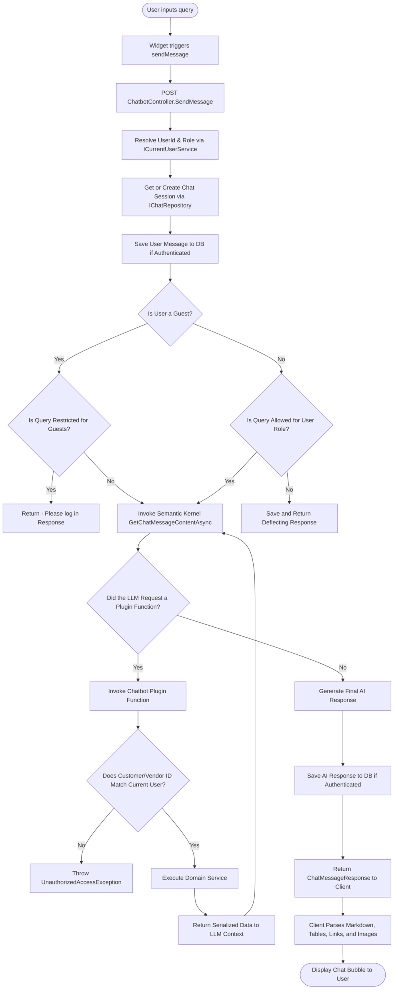
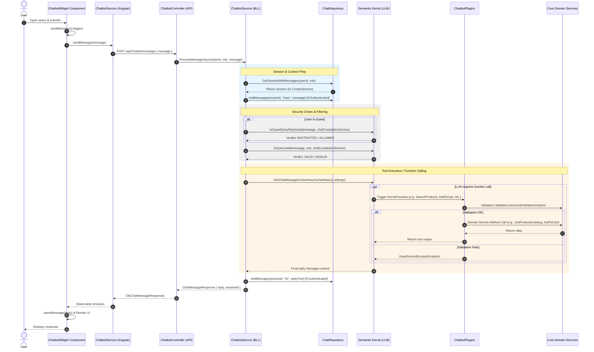

# AI Chatbot Implementation

This document describes how the interactive, role-based AI chatbot is implemented across the Angular frontend and ASP.NET Core backend using Microsoft Semantic Kernel, Groq/Gemini, and role-specific custom UI rendering.

---

## 1. System Architecture & Message Flow Chart

The chatbot architecture coordinates components across the frontend and backend. Below is the step-by-step decision flowchart showing how messages are processed, validated, and how functions are triggered.

### Decision Flowchart

### Sequence Diagram & Function Triggers

This sequence diagram maps the execution sequence, showing the exact function calls across the client-server boundaries:

---

## 2. Frontend Implementation (Angular)

### Chat Widget Component
*   **Files**: 
    *   [chatbot-widget.ts](file:///Users/dharshinik/Desktop/Presidio/Genspark/Ecommerce/frontend/src/app/components/shared/chatbot-widget/chatbot-widget.ts) (Logic)
    *   [chatbot-widget.html](file:///Users/dharshinik/Desktop/Presidio/Genspark/Ecommerce/frontend/src/app/components/shared/chatbot-widget/chatbot-widget.html) (Template)
    *   [chatbot-widget.css](file:///Users/dharshinik/Desktop/Presidio/Genspark/Ecommerce/frontend/src/app/components/shared/chatbot-widget/chatbot-widget.css) (Styles)
*   **Visibility Control**: The widget monitors route changes and automatically hides itself on login and registration pages.
*   **Dynamic Role-based Suggestion Chips**: Reads user roles (Admin, Vendor, Customer, or Guest) from the `AuthService` and presents context-appropriate suggestions (e.g., *Check inventory stock alerts* for Vendors, *Search for laptops* for Customers).
*   **Custom UI Rendering**: 
    *   **Text Blocks**: Normal message paragraphs.
    *   **Comparison Tables**: Renders multi-column comparison tables when product attribute lists are returned.
    *   **Variant Cards**: Parses image syntax `` into visual cards displaying the product image, title, and detailed specifications.
    *   **Actionable Links**: Detects custom links matching patterns like `product:id`, `order:id`, `cart`, `wishlist`, and `settlements` to navigate the user directly to the corresponding application pages.

### Service Client
*   **File**: [chatbot.service.ts](file:///Users/dharshinik/Desktop/Presidio/Genspark/Ecommerce/frontend/src/app/services/chatbot.service.ts)
*   **Endpoints**:
    *   `sendMessage(message: string)` -> `POST /api/Chatbot/message`
    *   `getChatHistory()` -> `GET /api/Chatbot/history`
    *   `clearChat()` -> `POST /api/Chatbot/clear`

---

## 3. Backend Implementation (ASP.NET Core)

### API Controller
*   **File**: [ChatbotController.cs](file:///Users/dharshinik/Desktop/Presidio/Genspark/Ecommerce/backend/Ecommerce.API/Controllers/ChatbotController.cs)
*   Exposes endpoints, maps requests, resolves the user context (retrieving `UserId` and `Role` from `ICurrentUserService`), and routes message payloads to `IChatbotService`.

### Orchestration Service
*   **File**: [ChatbotService.cs](file:///Users/dharshinik/Desktop/Presidio/Genspark/Ecommerce/backend/Ecommerce.BLL/ChatbotService.cs)
*   **Session Management**: Retrieves/creates chat session history using `IChatRepository`. Guest user sessions are ephemeral and are not persisted in the database.
*   **LLM Service Configuration & Fallback**:
    *   Initializes the `KernelBuilder` using **Microsoft Semantic Kernel**.
    *   Checks if `GroqSettings:ApiKey` is configured. If valid, configures `AddOpenAIChatCompletion` using `llama-3.3-70b-versatile` pointed to the Groq API endpoint.
    *   Fallback: If Groq API keys are missing or a request fails (e.g., rate limit exceeded / HTTP 429), it automatically falls back to **Google AI Gemini** (`gemini-2.5-flash`) via `AddGoogleAIGeminiChatCompletion`.
*   **Pre-Filter Security Gates**:
    1.  **Guest Gatekeeper**: Evaluates unauthenticated messages using `IsGuestQueryRestricted`. If a guest attempts to view/modify sensitive areas like their cart or wishlist, it interrupts the flow with a prompt to log in.
    2.  **Intent Guardrail**: Evaluates queries against role-permitted activities in `IsQueryValid`. If off-topic or prompt injection attempts are detected, it returns a polite, role-appropriate deflecting message.
*   **Tool Choice Integration**: Executes AI chat completions with `FunctionChoiceBehavior.Auto()` so the LLM can decide when to execute local plugins/tools.

---

## 4. Semantic Kernel Plugins (Tools)

*   **File**: [ChatbotPlugins.cs](file:///Users/dharshinik/Desktop/Presidio/Genspark/Ecommerce/backend/Ecommerce.BLL/Helper/ChatbotPlugins.cs)
*   Exposes domain services to the LLM using `[KernelFunction]` and `[Description]` annotations.
*   **Features by Role**:
    *   **Customer**:
        *   `SearchProducts(searchTerm)`: Finds matching products or returns the catalog.
        *   `GetProductDetails(productId)`: Returns specific variant specifications.
        *   `GetCart(customerId)`: Fetches current cart items.
        *   `AddToCart(variantId, quantity)`, `RemoveFromCart(cartItemId)`: Modifies cart items.
        *   `GetWishlist(customerId)`, `AddToWishlist(variantId)`, `RemoveFromWishlist(wishlistItemId)`: Wishlist management.
        *   `GetMyOrders(customerId)`, `GetOrderDetails(orderId)`: Order tracking and delivery status.
        *   `GetProductReviews(productId)`: Retrieves reviews for AI summarization.
    *   **Vendor**:
        *   `GetInventoryAlerts(vendorId)`: Finds low stock variants (stock < 10) in the vendor's store.
        *   `GetMySettlements(vendorId)`: Payout statistics.
    *   **Admin**:
        *   `GetPlatformKpis(month)`: Shows key platform statistics, revenue data, and dashboard trends.
        *   `GetVendorTurnoverList()`: Lists registered vendor store names with admin-calculated turnovers.

### Data Isolation & Validation Security
*   **File**: [Validation.cs](file:///Users/dharshinik/Desktop/Presidio/Genspark/Ecommerce/backend/Ecommerce.BLL/Helper/Validation.cs)
*   To prevent prompt injections where the LLM might be tricked into requesting another user's/vendor's data, all parameter inputs representing user IDs are validated in `Validation.ValidateCustomerId(customerId)` and `Validation.ValidateVendorId(vendorId)`.
*   These compare the ID supplied by the LLM against the actual authenticated session user ID resolved by the server's `ICurrentUserService`. If a mismatch is detected, an `UnauthorizedAccessException` is raised immediately.

---

## 5. Prompts & Instruction Rules

*   **File**: [ChatbotPrompt.cs](file:///Users/dharshinik/Desktop/Presidio/Genspark/Ecommerce/backend/Ecommerce.BLL/Helper/ChatbotPrompt.cs)
*   Centralizes role-specific system prompts:
    *   **Admin Prompt**: Restricts scope to KPI indicators, sales figures, and vendor lists, instructing the AI to use Markdown tables and custom routing links.
    *   **Vendor Prompt**: Limits inventory alert access and payouts strictly to their own store.
    *   **Customer Prompt**: Dictates how comparison tables must be formatted (e.g. comparing variants with specific attribute headers) and requests image tags where available.
