# Frontend Architecture & Documentation

This documentation provides an architectural overview and technical explanation of the **Angular Frontend** for the Bus Booking System. It covers core Angular concepts, reactive state design patterns, security mechanisms, and user experience optimizations built into the application.

---

## 🧭 Table of Contents
1. [Component-Based & Standalone Architecture](#1-component-based--standalone-architecture)
2. [Dynamic Route Lazy Loading](#2-dynamic-route-lazy-loading)
3. [Conditional Rendering & Iteration](#3-modern-control-flow-conditional-rendering--iteration)
4. [Dependency Injection (DI) Patterns](#4-dependency-injection-di-patterns)
5. [Reactive State Management with RxJS & Observables](#5-reactive-state-management-with-rxjs--observables)
6. [Authentication, Authorization & Role-Based Access Control (RBAC)](#6-authentication-authorization--role-based-access-control-rbac)
7. [Functional HTTP Interceptors (JWT Injection)](#7-functional-http-interceptors-jwt-injection)
8. [TypeScript Data Modeling & DTO Mapping](#8-typescript-data-modeling--dto-mapping)
9. [Dynamic FormArrays & Custom Reactive Validation](#9-dynamic-formarrays--custom-reactive-validation)
10. [Unified Reactive Toast Notification System](#10-unified-reactive-toast-notification-system)
11. [Responsive Design & Styles System](#11-responsive-design--styles-system)

---

## 1. Component-Based & Standalone Architecture
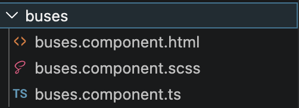

The application utilizes Angular's modern **Standalone Component Architecture** (introduced in Angular 14+). Standalone components eliminate the need for complex, boilerplate-heavy `NgModules` (`@NgModule`). 

### Key Characteristics:
* **Self-Contained Imports:** Every component explicitly declares its own dependencies via the `imports` array inside the `@Component` decorator (e.g., `CommonModule`, `ReactiveFormsModule`, `RouterLink`).
* **Clean Code Separation:** Each component represents a single responsibility comprising:
  - **HTML (`.component.html` or inline template):** Defines the structured view.
  - **Styles (`.component.scss` or inline styles):** Formulates component-specific visual constraints.
  - **Logic (`.component.ts`):** Powers the user interactions and interacts with data services.
* **Testing Note:** To keep build pipelines lightweight, unit test specs (`*.spec.ts`) are currently omitted and can be added incrementally.

---

## 2. Dynamic Route Lazy Loading
To optimize performance, reduce the initial bundle size, and accelerate the First Contentful Paint (FCP), the application's routes are configured with **Lazy Loading** in [app.routes.ts](file:///Users/dharshinik/Desktop/Presidio/Genspark/TASK1_BBS/frontend/src/app/app.routes.ts).

### Lazy Loading Configuration:
```typescript
{ 
  path: 'operator/dashboard', 
  loadComponent: () => import('./operator/dashboard/dashboard.component').then(m => m.OperatorDashboardComponent), 
  canActivate: [authGuard, roleGuard], 
  data: { role: 'Operator' } 
}
```
* **Dynamic Imports:** Component source code is fetched on-demand when the specific path is matched (via `loadComponent: () => import(...)`).
* **Separation of Concerns:** Unauthenticated users do not download the code for the Operator or Admin dashboards, which enhances both loading speed and security.

---

## 3. Conditional Rendering & Iteration

### Conditional Rendering (`@if`):
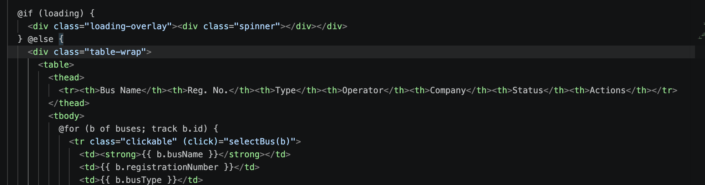
The application leverages the modern Angular control flow syntax (`@if`/`@else`) rather than the legacy `*ngIf` structural directive.
* **Syntax:**
  ```html
  @if (loading) {
    <app-spinner></app-spinner>
  } @else {
    <div class="content">...</div>
  }
  ```
* **Use Case:** To dynamically overlay spinner modules or placeholder cards during asynchronous data fetching.

### Data Iteration (`@for`):
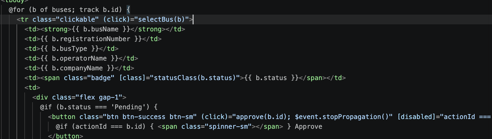
Data arrays are output to the DOM using the modern `@for` loop syntax, which includes native performance tracking features.
* **Syntax:**
  ```html
  @for (bus of buses; track bus.id) {
    <app-bus-card [bus]="bus"></app-bus-card>
  } @empty {
    <p>No buses found matching your search criteria.</p>
  }
  ```
* **Performance Gain:** The mandatory `track` clause acts like a unique key identifier, enabling Angular to surgically update modified items in the DOM rather than re-rendering the entire list.
* **Fallback Block:** The `@empty` block allows displaying a clean fallback message directly when the array is empty, without requiring nested conditional wrappers.

---

## 4. Dependency Injection (DI) Patterns
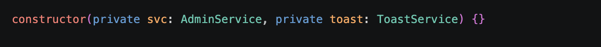

The application uses Dependency Injection (DI) to connect components with their required data services at runtime.

### Injecting Services:
Services are marked as `@Injectable({ providedIn: 'root' })`, registering them as singletons across the entire application lifecycle. The project employs two modern DI patterns:
1. **Constructor Injection (Class Components):**
   ```typescript
   constructor(private auth: AuthService, private router: Router) {}
   ```
2. **Functional Injection (`inject()` API for Guards & Interceptors):**
   ```typescript
   const auth = inject(AuthService);
   const router = inject(Router);
   ```

### Scope Security:
By declaring service dependencies as `private` or `private readonly`, they are locked to the internal scope of the component or guard and cannot be manipulated by parent template scopes.

---

## 5. Reactive State Management with RxJS & Observables
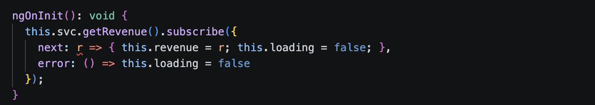

Asynchronous data events and cross-component communications are powered by **RxJS Observables** and **BehaviorSubjects**, following a robust Publish/Subscribe (Pub/Sub) pattern.

### Key Implementation Areas:
* **HTTP Requests:** Angular's `HttpClient` wraps standard Ajax queries inside cold Observables. Observables offer an array of advantages over Promises:
  - **Multi-value Emissions:** They can emit multiple values over time.
  - **Cancellability:** Subscriptions can be unsubscribed/aborted dynamically if the user navigates away mid-request.
  - **Stream Transformations:** Operations can be piped through operators like `tap`, `map`, and `catchError`.
* **Subscribers:** Services subscribe to backend triggers and process flows via 3 functional callbacks:
  1. `next`: Fired upon successful data retrieval.
  2. `error`: Fired if the API returns a validation fail or network error.
  3. `complete`: Fired when the request pipeline fully completes.

---

## 6. Authentication, Authorization & Role-Based Access Control (RBAC)
Authentication and navigation safety are managed dynamically using a combination of localStorage caching, reactive streams, and specialized Route Guards.

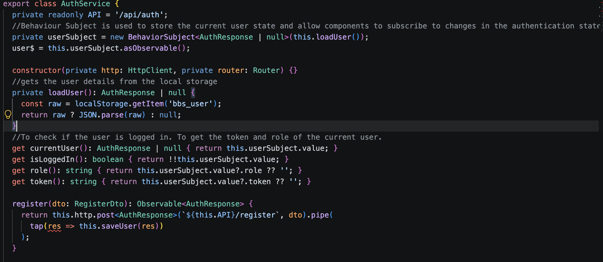

### Key Security Building Blocks:
* **`AuthService`**: Manages backend API login/register requests, saves session information, and broadcasts state changes.
* **Local Storage Caching**: Persists the returned JWT token, user name, and role under the key `'bbs_user'` to maintain sessions across browser refreshes.
* **`BehaviorSubject` (`userSubject`)**: A reactive state container holding the current user profile. It holds a default value (by reading local storage initially) and multicasts the login status to any subscribing component.
* **Role-Based Guards**:
  - `authGuard`: Inspects the `AuthService` login state. If not authenticated, redirects the client to the login page (`/auth/login`).
  - `roleGuard`: Restricts route entry by comparing user roles against the `role` metadata parameter declared on the route configuration (`route.data['role']`).


### Log-In & Log-Out State Workflows:

**Login Flow:**
```text
User clicks Login ➔ AuthService.login() ➔ Backend validates ➔ Returns JWT ➔ saveUser() ➔ Caches in localStorage & Updates userSubject ➔ Route to Home / Dashboard
```
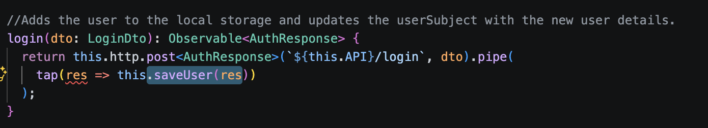

**Logout Flow:**
```text
User clicks Logout ➔ Remove localStorage cache ➔ userSubject.next(null) ➔ Navigate to Login page
```
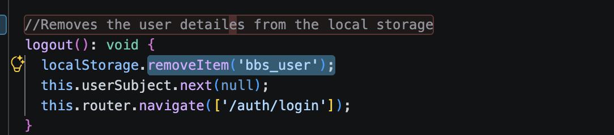

---

## 7. Functional HTTP Interceptors (JWT Injection)
To guarantee secure API calls, the frontend intercepts all outbound HTTP requests using a modern **Functional Interceptor** (`HttpInterceptorFn`).

```text
Angular Component/Service
          │
          ▼
      HttpClient
          │
          ▼
   [ jwtInterceptor ] ────► Inject AuthService ➔ Read cached JWT Token
          │
          ▼
   Does Token Exist?
     - YES ➔ Clone Request, Append "Authorization: Bearer <token>" Header
     - NO  ➔ Pass Request Through Unaltered
          │
          ▼
      Backend API
```
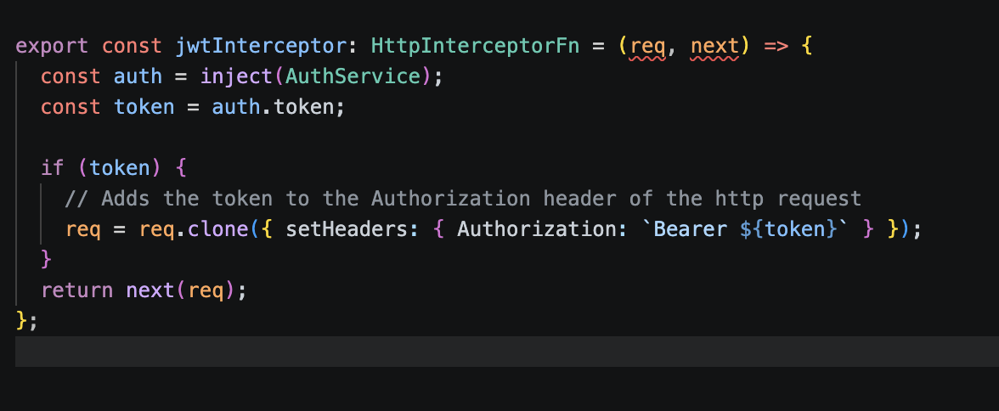

### JWT Interceptor Code Details:
```typescript
export const jwtInterceptor: HttpInterceptorFn = (req, next) => {
  const auth = inject(AuthService);
  const token = auth.token;

  if (token) {
    req = req.clone({ setHeaders: { Authorization: `Bearer ${token}` } });
  }
  return next(req);
};
```
* **Immutability:** Outgoing requests are cloned before modification because HTTP request objects in Angular are immutable.

---

## 8. TypeScript Data Modeling & DTO Mapping
To secure strong typing and prevent runtime structural conflicts, the frontend contains comprehensive TypeScript interface mappings in [models.ts](file:///Users/dharshinik/Desktop/Presidio/Genspark/TASK1_BBS/frontend/src/app/models/models.ts).

### Model Organization:
* Interfaces are mapped exactly to corresponding .NET Backend **Data Transfer Objects (DTOs)**.
* **Separation of Concerns:** Model structures do not house inline instantiation logic or constructors inside component controllers. Custom helper routines or standard objects are maintained directly in the models layer, keeping components focused on UI logic.
* **Core Interfaces Include:** `AuthResponse`, `BusSearchResult`, `CreateBookingDto`, `BookingResponse`, `LayoutDto`, `OperatorProfile`, and `RevenueDto`.

---

## 9. Dynamic FormArrays & Custom Reactive Validation
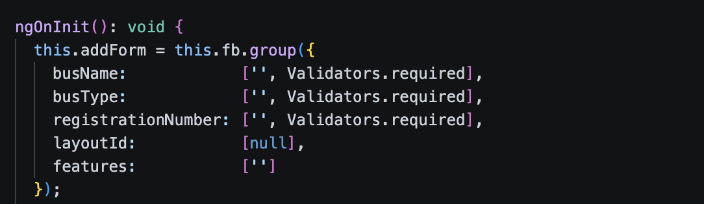

When booking multiple seats, the checkout screen must adapt to capture data for each passenger. This is handled dynamically using Angular **Reactive Form validation**.

### Implementation Highlights:
* **Dynamic Form Creation:** Upon successful seat blocking, a `FormArray` is initialized with a variable length matching the exact count of selected seats.
  ```typescript
  buildPassengerForm(): void {
    const arr = this.fb.array(this.selectedSeats.map(s => this.fb.group({
      seatNumber:    [s],
      passengerName: ['', Validators.required],
      age:           ['', [Validators.required, Validators.min(1)]],
      gender:        ['', Validators.required]
    })));
    this.passengerForm = this.fb.group({ passengers: arr });
  }
  ```
* **Women-Only Custom Business Validation:** 
  To enforce female safety policies, the frontend performs a specialized structural gender check prior to submitting bookings. If a seat is flagged as `womenOnly` by the backend layout schema, the component loops through the passenger forms. If the matching passenger's selected gender is not `Female`, the request is aborted and a `Gender Mismatch` alert toast is displayed:
  ```typescript
  for (const p of passengers) {
    if (this.isWomenOnly(p.seatNumber) && p.gender !== 'Female') {
      this.toast.error('Gender Mismatch', `Seat ${p.seatNumber} is reserved for women only.`);
      this.booking = false;
      return;
    }
  }
  ```

---

## 10. Unified Reactive Toast Notification System
The application features a responsive notification toast alert system managed via a unified reactive queue.

### Architectural Breakdown:
* **`ToastService`**: Exposes utility methods (`success`, `error`, `warning`, `info`) which append a new notification payload to an RxJS `BehaviorSubject<Toast[]>` array.
* **Auto-Dismissal Timer:** When a toast is added, a 4-second timeout is scheduled. When the timeout fires, it calls `remove(id)` to filter out the expired toast, ensuring the toast stack is self-cleaning.
* **`ToastComponent`**: Statically injected at the root level (`app.component.ts`), it subscribes to `toasts$` and outputs floating notifications dynamically. Emoticons are automatically assigned based on notification category:
  ```typescript
  icons: Record<string, string> = {
    success: '✅', danger: '❌', warning: '⚠️', info: 'ℹ️'
  };
  ```

---

## 11. Responsive Design & Styles System
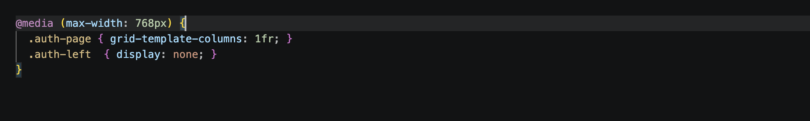

The application styling is built using responsive layouts powered by SCSS and CSS Media Queries.

### Responsive Principles:
* **Fluid Grids:** Grid containers adapt dynamically depending on the active client viewport.
* **Media Query Rules:** Specialized styles are applied based on device widths to guarantee premium presentation on mobiles, tablets, and desktop workstations.
* **CSS Custom Properties (Variables):** Standard colors, fonts, margins, and transition variables are maintained in a centralized design token directory to secure visual consistency across pages.

---

