# Project Title

Library System with Book and Member CRUD operations

## Features

- Add and Get Book
- Add and Get Members
- Get all Books and Members
(As mentioned in the Assignment)

## Concepts Used

- **Dependency Injection and Dependency Inversion**
* The dependent objects are injected with Controller based injection creating loose coupling.
* The Controller is depent on Interfaces and not directly on Concrete Classes.
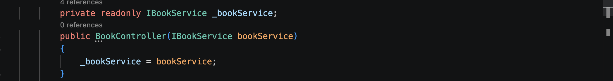

- **Abstracting the Connection String by adding it to appsettings.json**
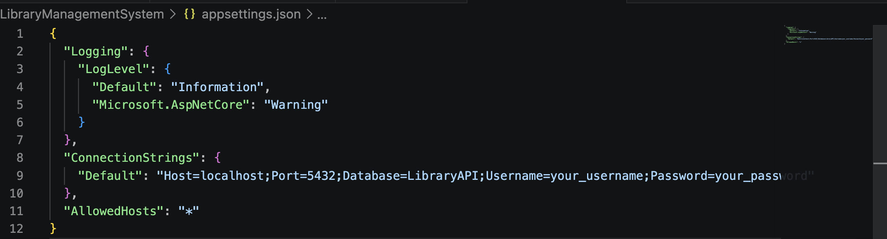

- **Builder Creational Pattern**
* Created the WebApplication wrt to Builder Pattern.
* All components are added to it.
* On Execution, it is build to one unit.
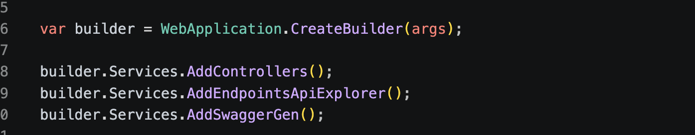

- **Scopped Injections**
* Added Components to the Builder with **scoped** type injection (connection created and terminated per each request).
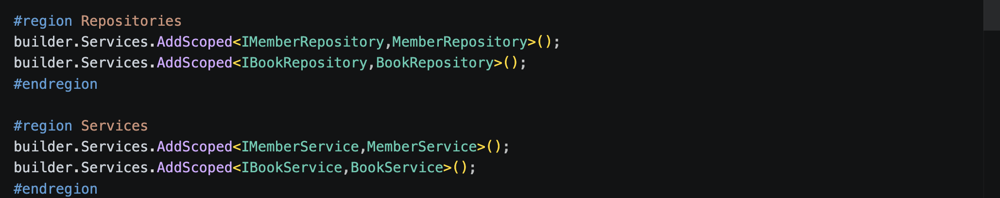

- **Region**
* Created Logical Separation 
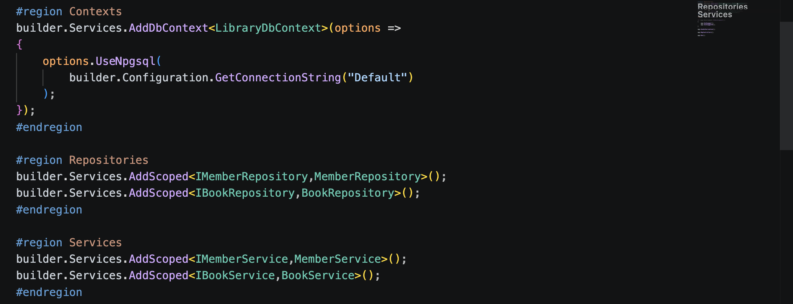

- **Swagger API**
* Used Swagger API for output testing
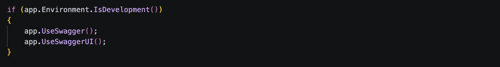

## Output Screenshots
- **GetBooks()**
* This api retrieves all the Books with Status code 200 (OK)
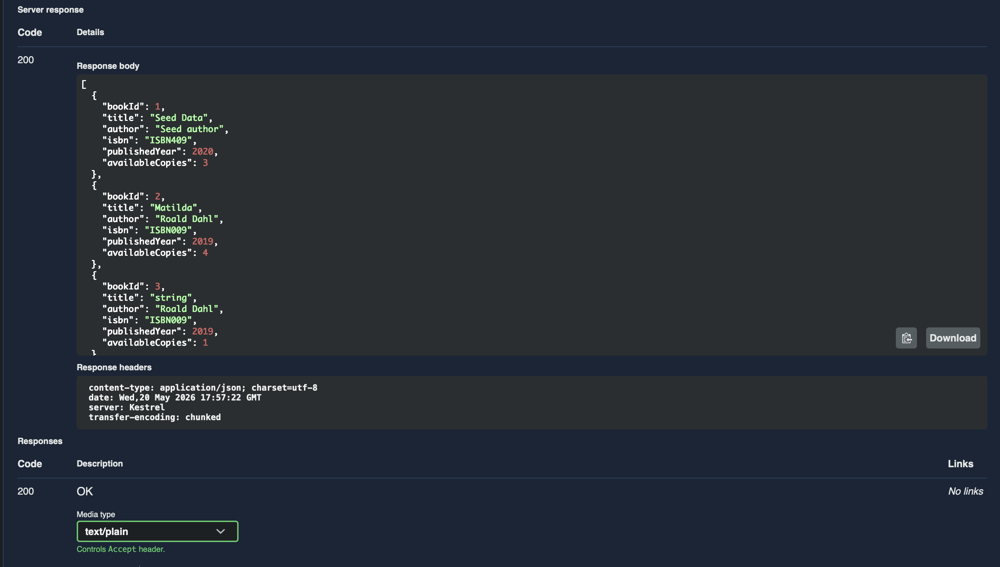

- **GetBook(int bookId)**
* Retrieves Book by bookId, if Found -> 200(OK)
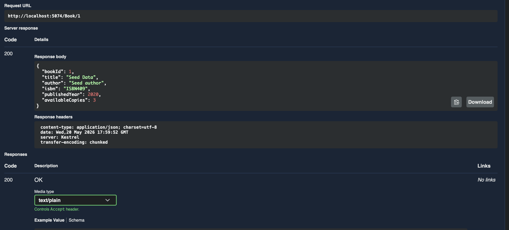
*If not Found -> 404(Not Found)
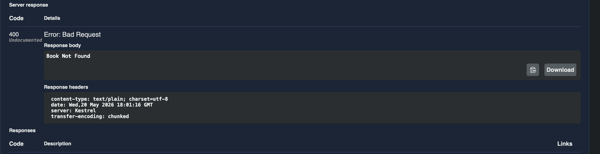

- **PostBook(BookRequestDTO book)**
* On successful entry of valid Data -> 201(Created)
* Title Validation -> IF empty -> 400(Bad Request)
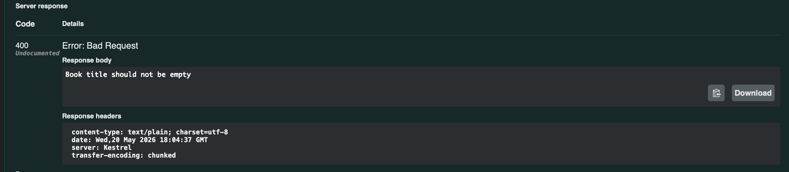
* Author Validation -> If Empty -> 400 (Bad Request)
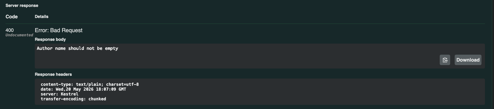
* Available Copies < 0 -> 400 (Bad Request)
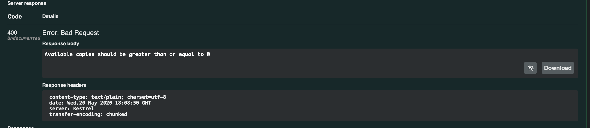
## Installation

(commands here)

## Usage

(commands or steps)

## API Endpoints

(optional)

## Folder Structure

(optional)

## Environment Variables

(optional)

## Deployment

(optional)

## Author

Your name